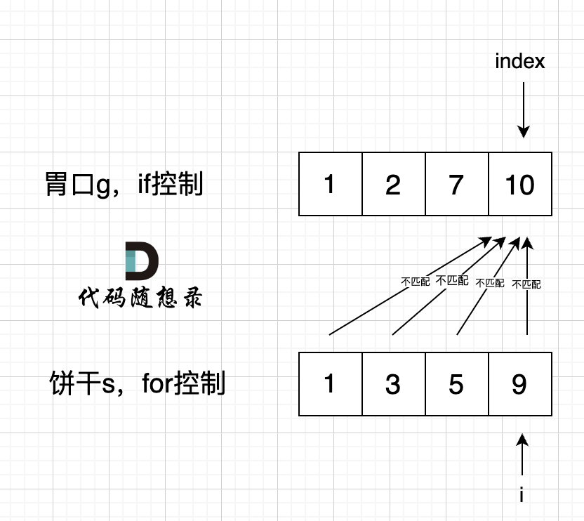

# 数组

## 分发饼干

[455. 分发饼干 - 力扣（LeetCode）](https://leetcode.cn/problems/assign-cookies/)

### 排序+贪心法+双指针

[代码随想录 (programmercarl.com)](https://programmercarl.com/0455.分发饼干.html)

为了满足更多的小孩，就不要造成饼干尺寸的浪费。

大尺寸的饼干既可以满足胃口大的孩子也可以满足胃口小的孩子，那么就应该优先满足胃口大的。

==这里的局部最优就是大饼干喂给胃口大的，充分利用饼干尺寸喂饱一个，全局最优就是喂饱尽可能多的小孩。==

可以尝试使用贪心策略，先将饼干数组和小孩数组排序。

然后从后向前遍历小孩数组，用大饼干优先满足胃口大的，并统计满足小孩数量。

如图：


这个例子可以看出饼干9只有喂给胃口为7的小孩，这样才是整体最优解，并想不出反例，那么就可以撸代码了。


#### 代码

```cpp
// 版本一 
// 时间复杂度：O(nlogn)
// 空间复杂度：O(1)
class Solution {
public:
    int findContentChildren(vector<int>& g, vector<int>& s) {
        sort(g.begin(), g.end());
        sort(s.begin(), s.end());
        int index = s.size() - 1; // 饼干数组的下标
        int result = 0;
        for (int i = g.size() - 1; i >= 0; i--) { // 遍历胃口 
            if (index >= 0 && s[index] >= g[i]) { // 遍历饼干 
                result++;
                index--;
            }
        }
        return result;
    }
};
```

从代码中可以看出我用了一个index来控制饼干数组的遍历，遍历饼干并没有再起一个for循环，而是采用自减的方式，这也是常用的技巧。

有的同学看到要遍历两个数组，就想到用两个for循环，那样逻辑其实就复杂了

#### 注意事项

注意版本一的代码中，可以看出来，是先遍历的胃口，在遍历的饼干，那么可不可以 先遍历 饼干，在遍历胃口呢？

其实是不可以的。

外面的for 是里的下标i 是固定移动的，而if里面的下标 index 是符合条件才移动的。

如果 for 控制的是饼干， if 控制胃口，就是出现如下情况 ：



if 里的 index 指向 胃口 10， for里的i指向饼干9，因为 饼干9 满足不了 胃口10，所以 i 持续向前移动，而index 走不到`s[index] >= g[i]` 的逻辑，所以index不会移动，那么当i 持续向前移动，最后所有的饼干都匹配不上。

所以 一定要for 控制 胃口，里面的if控制饼干。

#### 其他

**也可以换一个思路，小饼干先喂饱小胃口**

```
class Solution {
public:
    int findContentChildren(vector<int>& g, vector<int>& s) {
        sort(g.begin(),g.end());
        sort(s.begin(),s.end());
        int index = 0;
        for(int i = 0; i < s.size(); i++) { // 饼干
            if(index < g.size() && g[index] <= s[i]){ // 胃口
                index++;
            }
        }
        return index;
    }
};
```


## [有效的山脉数组](https://leetcode.cn/problems/valid-mountain-array/)


## 寻找数组的中心下标

[数组]

[力扣题目链接(opens new window)a](https://leetcode.cn/problems/find-pivot-index/)


## 按奇偶排序数组II

[922. 按奇偶排序数组 II - 力扣（LeetCode）](https://leetcode.cn/problems/sort-array-by-parity-ii/)

给定一个非负整数数组 A， A 中一半整数是奇数，一半整数是偶数。

对数组进行排序，以便当 A[i] 为奇数时，i 也是奇数；当 A[i] 为偶数时， i 也是偶数。

你可以返回任何满足上述条件的数组作为答案。

示例：

* 输入：[4,2,5,7]
* 输出：[4,5,2,7]
* 解释：[4,7,2,5]，[2,5,4,7]，[2,7,4,5] 也会被接受。


优化版本

```cpp
class Solution {
public:
    vector<int> sortArrayByParityII(vector<int>& A) {
        vector<int> result(A.size());
        int evenIndex = 0;  // 偶数下标
        int oddIndex = 1;   // 奇数下标
        for (int i = 0; i < A.size(); i++) {
            if (A[i] % 2 == 0) {
                result[evenIndex] = A[i];
                evenIndex += 2;
            }
            else {
                result[oddIndex] = A[i];
                oddIndex += 2;
            }
        }
        return result;
    }
};
```


空间复杂度o(1)

```
class Solution {
public:
    bool validMountainArray(vector<int>& arr) {
        int index=0;
        for(int i=1;i<arr.size();i++){
            if(arr[i]==arr[i-1])return false;
            if(arr[i]>arr[i-1]){
                index++;
            }
            else{
                break;
            }

        }
        cout<<index<<endl;
        //index==0表明arr[1]<arrp[0]导致推出循环
        //index=arr.size()-1;一直到最后也没有找到index
        if(index==0||index==arr.size()-1){
            return false;
        }
        for(int i=index+1;i<arr.size();i++){
            if(arr[i]>=arr[i-1])return false;
        }
        return true;
    }
};
```


## 旋转数组

[189. 轮转数组 - 力扣（LeetCode）](https://leetcode.cn/problems/rotate-array/solutions/551039/xuan-zhuan-shu-zu-by-leetcode-solution-nipk/?envType=study-plan-v2&envId=top-interview-150)

### 使用额外的空间

```
class Solution {
public:
    void rotate(vector<int>& nums, int k) {
        vector<int> temp=nums;
        int n=k%nums.size();
        for(int i=0;i<nums.size();i++){
            int index=(i+n)%(nums.size());
            nums[index]=temp[i];
        }
        return ;
    }
};
```

### 数组反转

```
class Solution {
public:

    void rotate(vector<int>& nums, int k) {
        if(nums.size()<=1)return;
        k=k%nums.size();
        reverse(nums.begin(),nums.end());
        reverse(nums.begin(),nums.begin()+k);
        reverse(nums.begin()+k,nums.end());
        
    }
};
```


## 区间问题

### 插入区间

给你一个 **无重叠的** *，*按照区间起始端点排序的区间列表。

在列表中插入一个新的区间，你需要确保列表中的区间仍然有序且不重叠（如果有必要的话，可以合并区间）

**示例 1：**

```
输入：intervals = [[1,3],[6,9]], newInterval = [2,5]
输出：[[1,5],[6,9]]
```

**示例 2：**

```
输入：intervals = [[1,2],[3,5],[6,7],[8,10],[12,16]], newInterval = [4,8]
输出：[[1,2],[3,10],[12,16]]
解释：这是因为新的区间 [4,8] 与 [3,5],[6,7],[8,10] 重叠。
```

**示例 3：**

```
输入：intervals = [], newInterval = [5,7]
输出：[[5,7]]
```

**示例 4：**

```
输入：intervals = [[1,5]], newInterval = [2,3]
输出：[[1,5]]
```

**示例 5：**

```
输入：intervals = [[1,5]], newInterval = [2,7]
输出：[[1,7]]
```


#### 模拟法

```cpp
class Solution {
public:
    vector<vector<int>> insert(vector<vector<int>>& intervals, vector<int>& newInterval) {
        int left=newInterval[0];
        int right=newInterval[1];
        bool placed=false;
        vector<vector<int>> res;
        for(const auto interval:intervals){
            if(placed){
                res.push_back(interval);
                continue;
            }
            if(interval[1]<left){//interval在左边，不用管，直接加入
                res.push_back(interval);
            }
            else if(interval[0]>right){
                res.push_back({left,right});
                placed=true;
                res.push_back(interval);
            }
            else{//有重叠，开始合并
                left=min(left,interval[0]);
                right=max(right,interval[1]);

            }
        }
        if(!placed){
            res.push_back({left,right});
     
        }
        return res;
    }
};
```

## 环形数组

[环形子数组的最大和](https://leetcode.cn/problems/maximum-sum-circular-subarray/)

[189. 轮转数组 - 力扣（LeetCode）](https://leetcode.cn/problems/rotate-array/)

## 矩阵

### [螺旋矩阵](https://leetcode.cn/problems/spiral-matrix/)

### [螺旋矩阵 II](https://leetcode.cn/problems/spiral-matrix-ii/)

### [旋转图像](https://leetcode.cn/problems/rotate-image/)

### [矩阵置零](https://leetcode.cn/problems/set-matrix-zeroes/)

### 扑克牌中的顺子

[剑指 Offer 61. 扑克牌中的顺子 - 力扣（LeetCode）](https://leetcode.cn/problems/bu-ke-pai-zhong-de-shun-zi-lcof/description/)、

