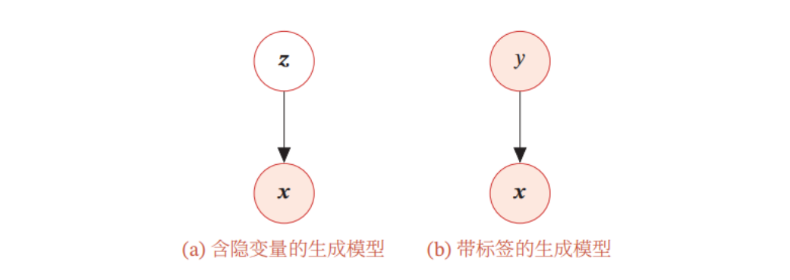

# **生成模型的功能**

生成模型一般具有两个基本功能：密度估计和生成样本

## 密度估计  

给定一组数据 $\mathcal{D}=\left\{\boldsymbol{x}^{(n)}\right\}_{n=1}^N$, 假设它们都是独立地从相同的概率密度函数为 $p_r(\boldsymbol{x})$ 的未知分布中产生的. 密度估计 (Density Estimation) 是根据数据集 $\mathcal{D}$来估计其概率密度函数 $p_\theta(\boldsymbol{x})$.

在机器学习中, 密度估计是一类无监督学习问题. 比如在手写体数字图像的密度估计问题中, 我们将图像表示为一个随机向量 $\boldsymbol{X}$, 其中每一维都表示一个像素值. 假设手写体数字图像都服从一个未知的分布 $p_r(\boldsymbol{x})$, 希望通过一些观测样本来估计其分布. 但是, 手写体数字图像中不同像素之间存在复杂的依赖关系 (比如相邻像素的颜色一般是相似的 ), 很难用一个明确的图模型来描述其依赖关系, 所以直接建模 $p_r(\boldsymbol{x})$ 比较困难. 

因此, 我们通常通过引入隐变量 $\boldsymbol{z}$ 来简化模型, 这样密度估计问题可以转换为估计变

量 $(\boldsymbol{x}, \boldsymbol{z})$ 的两个局部条件概率 $p_\theta(\boldsymbol{z})$ 和 $p_\theta(\boldsymbol{x} \mid \boldsymbol{z})$. 一般为了简化模型, 假设隐变量 $\boldsymbol{z}$ 的先验分布为标准高斯分布 $\mathcal{N}(\mathbf{0}, \boldsymbol{I})$.隐变量 $\boldsymbol{z}$ 的每一维之间都是独立的. 在这个假设下, 先验分布 $p(\boldsymbol{z} ; \boldsymbol{\theta})$ 中没有参数.因此,密度估计的重点是估计条件分布 $p(\boldsymbol{x} \mid \boldsymbol{z} ; \theta)$.

如果要建模含隐变量的分布, 就需要利用 EM 算法来进行密度估计. 而在 EM 算法中, 需要估计条件分布 $p(\boldsymbol{x} \mid \boldsymbol{z} ; \theta)$ 以及近似后验分布 $p(\boldsymbol{z} \mid \boldsymbol{x} ; \theta)$.当这两个分布比较复杂时, 我们可以利用神经网络来进行建模, 这就是==变分自编码器==的思想.

