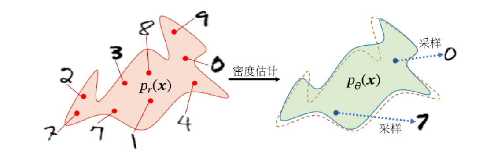

# 深度生成模型

==概率生成模型== (Probabilistic Generative Model), 简称生成模型, 是概率统计和机器学习领域的一类重要模型, 指一系列用于随机生成可观测数据的模型.

假设在一个连续或离散的高维空间 $\mathcal{X}$ 中, 存在一个随机向量 $\boldsymbol{X}$ 服从一个未知的数据分布 $p_r(\boldsymbol{x}), \boldsymbol{x} \in X$. 生成模型是根据一些可观测的样本 $\boldsymbol{x}^{(1)}, \boldsymbol{x}^{(2)}, \cdots, \boldsymbol{x}^{(N)}$ 来学习一个参数化的模型 $p_\theta(\boldsymbol{x})$ 来近似未知分布 $p_r(\boldsymbol{x})$, 并可以用这个模型来生成一些样本, 使得 “生成” 的样本和 “真实” 的样本尽可能地相似. 

生成模型通常包含两个基本功能: ==概率密度估计==和生成样本 (即采样). 下图以手写体数字图像为例给出了生成模型的两个功能示例, 其中左图表示手写体数字图像的真实分布 $p_r(\boldsymbol{x})$ 以及从中采样的一些 “真实” 样本, 右图表示估计出了分布 $p_\theta(\boldsymbol{x})$ 以及从中采样的 “生成”样本.

生成模型的应用十分广泛，可以用来建模不同的数据，比如图像、文本、声音等．但对于一个高维空间中的复杂分布，密度估计和生成样本通常都不容易实现，原因在于：

1. 高维随机向量一般比较难以直接建模，需要通过一些条件独立性来简化模型；
2. 给定一个已建模的复杂分布，也缺乏有效的采样方法.

深度生成模型就是利用深度神经网络可以近似任意函数的能力来建模一个复杂分布 $p_r(\boldsymbol{x})$ 或直接生成符合分布$p_r(\boldsymbol{x})$ 的样本．本章先介绍概率生成模型的基本概念，然后介绍两种深度生成模型：变分自编码器和生成对抗网络．
