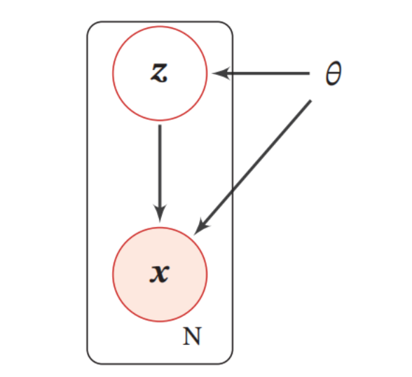
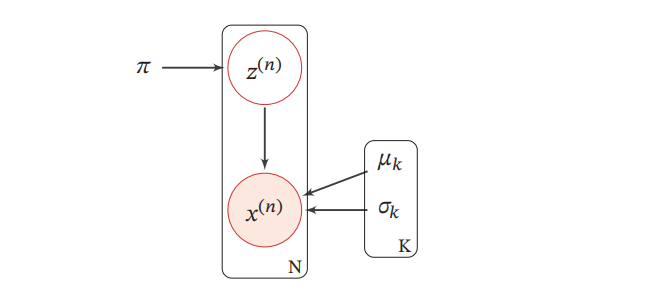
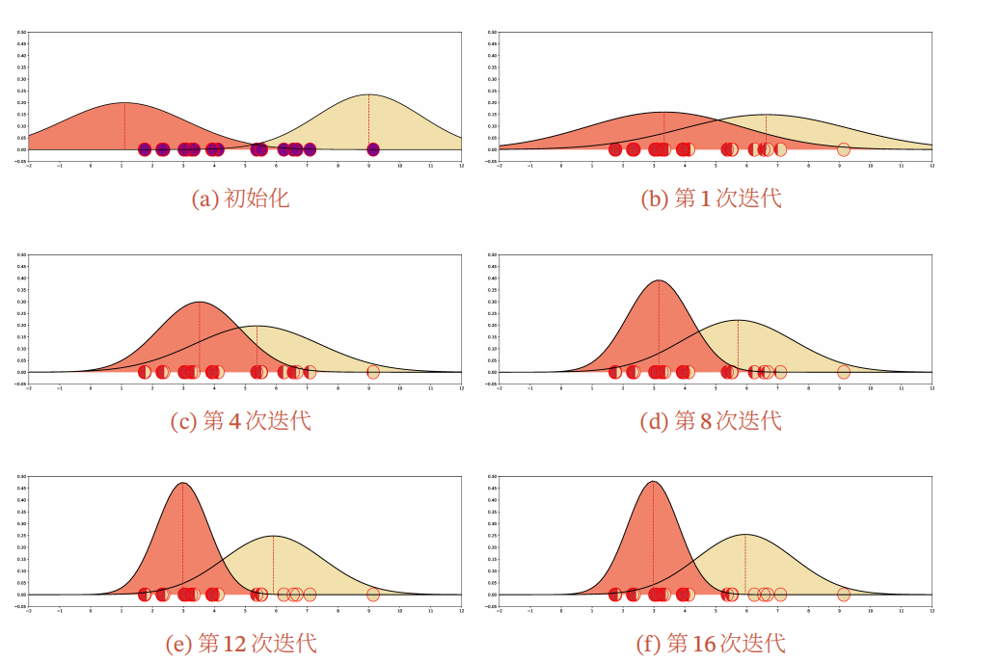

# 参数学习

图模型的学习可以分为两部分：一是==网络结构学习==，即寻找最优的网络结构；二是==网络参数估计==，即已知网络结构，估计每个条件概率分布的参数．

网络结构学习比较困难，一般是由领域专家来构建．本节只讨论在给定网络结构条件下的参数估计问题．图模型的参数估计问题又分为不包含隐变量时的参数估计问题和包含隐变量时的参数估计问题．

## **不含隐变量的参数估计**

如果图模型中不包含隐变量，即所有变量都是可观测的，那么网络参数一般可以直接通过==最大似然==来进行估计．

### **有向图模型** 

在有向图模型中, 所有变量 $\boldsymbol{x}$ 的联合概率分布可以分解为每个随机变量 $x_k$ 的局部条件概率 $p\left(x_k \mid x_{\pi_k} ; \theta_k\right)$ 的连乘形式, 其中 $\theta_k$ 为第 $k$ 个变量的局部条件概率的参数.
给定 $N$ 个训练样本 $\mathcal{D}=\left\{\boldsymbol{x}^{(n)}\right\}_{n=1}^N$, 其对数似然函数为
$$
\begin{aligned}
\mathcal{L}(\mathcal{D} ; \theta) & =\frac{1}{N} \sum_{n=1}^N \log p\left(\boldsymbol{x}^{(n)} ; \theta\right) \\
& =\frac{1}{N} \sum_{n=1}^N \sum_{k=1}^K \log p\left(x_k^{(n)} \mid x_{\pi_k}^{(n)} ; \theta_k\right),
\end{aligned}
$$

其中 $\theta_k$ 为模型中的所有参数.
因为所有变量都是可观测的, 最大化对数似然 $\mathcal{L}(\mathcal{D} ; \theta)$, 只需要分别最大化每个变量的条件似然来估计其参数.
$$
\begin{equation}
\label{youxiang}
\theta_k=\arg \max \sum_{n=1}^N \log p\left(x_k^{(n)} \mid x_{\pi_k}^{(n)} ; \theta_k\right)
\end{equation}
$$
如果变量 𝒙 是离散的，简单直接的方式是在训练集上统计每个变量的条件概率表．但是条件概率表需要的参数比较多．假设条件概率 $p(x_k|x_{\pi_k})$ 的父节点数量为𝑀，所有变量为二值变量，其条件概率表需要 $2^M$ 个参数．为了减少参数数量，可以使用参数化的模型，比如Sigmoid信念网络．如果变量 $x$ 是连续的，可以使用高斯函数来表示条件概率分布，称为高斯信念网络．在此基础上，还可以通过让所有的条件概率分布共享使用同一组参数来进一步减少参数的数量．

### **无向图模型**

在无向图模型中, 所有变量 $\boldsymbol{x}$ 的联合概率分布可以分解为定义在最大团上的势能函数的连乘形式. 以对数线性模型为例,
$$
p(\boldsymbol{x} ; \theta)=\frac{1}{Z(\theta)} \exp \left(\sum_{c \in \mathcal{C}} \theta_c^{\top} f_c\left(\boldsymbol{x}_c\right)\right),
$$

其中 $Z(\theta)=\sum_x \exp \left(\sum_{c \in \mathcal{C}} \theta_c^{\top} f_c\left(\boldsymbol{x}_c\right)\right)$.
给定 $N$ 个训练样本 $\mathcal{D}=\left\{\boldsymbol{x}^{(n)}\right\}_{n=1}^N$, 其对数似然函数为
$$
\begin{aligned}
\mathcal{L}(\mathcal{D} ; \theta) & =\frac{1}{N} \sum_{n=1}^N \log p\left(\boldsymbol{x}^{(n)} ; \theta\right) \\
& =\frac{1}{N} \sum_{n=1}^N\left(\sum_{c \in \mathcal{C}} \theta_c^{\top} f_c\left(\boldsymbol{x}_c^{(n)}\right)\right)-\log Z(\theta),
\end{aligned}
$$

其中 $\theta_c$ 为定义在团 $c$ 上的势能函数的参数.
采用梯度上升方法进行最大似然估计, $\mathcal{L}(\mathcal{D} ; \theta)$ 关于参数 $\theta_c$ 的偏导数为
$$
\frac{\partial \mathcal{L}(\mathcal{D} ; \theta)}{\partial \theta_c}=\frac{1}{N} \sum_{n=1}^N\left(f_c\left(\boldsymbol{x}_c^{(n)}\right)\right)-\frac{\partial \log Z(\theta)}{\partial \theta_c}
$$

其中
$$
\begin{aligned}
\frac{\partial \log Z(\theta)}{\partial \theta_c} & =\sum_{\boldsymbol{x}} \frac{1}{Z(\theta)} \cdot \exp \left(\sum_{c \in \mathcal{C}} \theta_c^{\top} f_c\left(\boldsymbol{x}_c\right)\right) \cdot f_c\left(\boldsymbol{x}_c\right) \\
& =\sum_{\boldsymbol{x}} p(\boldsymbol{x} ; \theta) f_c\left(\boldsymbol{x}_c\right) \triangleq \mathbb{E}_{\boldsymbol{x} \sim p(x ; \theta)}\left[f_c\left(\boldsymbol{x}_c\right)\right] .
\end{aligned}
$$

因此,
$$
\begin{equation}
\label{wx}
\begin{aligned}
\frac{\partial \mathcal{L}(\mathcal{D} ; \theta)}{\partial \theta_c} & =\frac{1}{N} \sum_{n=1}^N f_c\left(\boldsymbol{x}_c^{(n)}\right)-\mathbb{E}_{\boldsymbol{x} \sim p(\boldsymbol{x} ; \theta)}\left[f_c\left(\boldsymbol{x}_c\right)\right] \\
& =\mathbb{E}_{\boldsymbol{x} \sim \tilde{p}(\boldsymbol{x})}\left[f_c\left(\boldsymbol{x}_c\right)\right]-\mathbb{E}_{\boldsymbol{x} \sim p(\boldsymbol{x} ; \theta)}\left[f_{\mathcal{c}}\left(\boldsymbol{x}_c\right)\right],
\end{aligned}
\end{equation}
$$

其中 $\tilde{p}(\boldsymbol{x})$ 定义为经验分布 (Empirical Distribution). 由于在最优点时梯度为 0 , 因此无向图的最大似然估计的优化目标等价于: 对于每个团 $c$ 上的特征 $f_c\left(\boldsymbol{x}_c\right)$,使得其在经验分布 $\tilde{p}(\boldsymbol{x})$ 下的期望等于其在模型分布 $p(\boldsymbol{x} ; \theta)$ 下的期望.

对比公式 $\ref{youxiang}$ 和公式 $\ref{wx}$ 可以看出, 无向图模型的参数估计要比有向图更为复杂. 在有向图中, 每个局部条件概率的参数是独立的; 而在无向图中, 所有的参数都是相关的, 无法分解.

对于一般的无向图模型, 公式 $\ref{wx}$中的 $\mathbb{E}_{\boldsymbol{x} \sim p(\boldsymbol{x} ; \boldsymbol{\theta})}\left[f_c\left(\boldsymbol{x}_c\right)\right]$ 往往很难计算,因为涉及在联合概率空间 $p(\boldsymbol{x} ; \boldsymbol{\theta})$ 计算期望. 当模型变量比较多时, 这个计算往往无法实现. 因此, 无向图的参数估计通常采用近似的方法: 

1. 利用采样来近似计算这个期望; 
2. 采用坐标上升法, 即固定其他参数, 来优化一个势能函数的参数.

## **含隐变量的参数估计**

如果图模型中包含隐变量，即有部分变量是不可观测的，就需要用EM 算法进行参数估计．

### EM算法

[【机器学习】EM——期望最大（非常详细） - 知乎 (zhihu.com)](https://zhuanlan.zhihu.com/p/78311644)

在一个包含隐变量的图模型中, 令 $\boldsymbol{X}$ 定义可观测变量集合, $\boldsymbol{Z}$ 定义隐变量集合,一个样本 $\boldsymbol{x}$ 的边际似然函数 (Marginal Likelihood) 为
$$
p(\boldsymbol{x} ; \theta)=\sum_z p(\boldsymbol{x}, \boldsymbol{z} ; \theta),
$$

其中 $\theta$ 为模型参数. 边际似然也称为==证据== (Evidence).
下图给出了带隐变量的贝叶斯网络的图模型结构, 其中矩形表示其中的变量重复 $N$ 次. 这种表示方法称为盘子表示法 (Plate Notation), 是图模型中表示重复变量的方法.

给定 $N$ 个训练样本 $\mathcal{D}=\left\{\boldsymbol{x}^{(n)}\right\}_{n=1}^N$, 整个训练集的对数边际似然为
$$
\begin{aligned}
\mathcal{L}(\mathcal{D} ; \theta) & =\frac{1}{N} \sum_{n=1}^N \log p\left(\boldsymbol{x}^{(n)} ; \theta\right) \\
& =\frac{1}{N} \sum_{n=1}^N \log \sum_{\boldsymbol{z}} p\left(\boldsymbol{x}^{(n)}, \boldsymbol{z} ; \theta\right) .
\end{aligned}
$$
通过最大化整个训练集的对数边际似然 $\mathcal{L}(\mathcal{D} ; \theta)$, 可以估计出最优的参数 $\theta^*$. 然而计算边际似然函数时涉及 $p(x)$ 的==推断==问题, 需要在对数函数的内部进行求和 (或积分). 这样, 当计算参数 $\theta$ 的梯度时, 这个求和操作依然存在. 除非 $p(\boldsymbol{x}, \boldsymbol{z} ; \theta)$ 的形式非常简单, 否则这个求和难以直接计算.

为了计算 $\log p(\boldsymbol{x} ; \theta)$, 我们引入一个额外的变分函数 $q(\boldsymbol{z}), q(\boldsymbol{z})$ 为定义在隐变量 $\boldsymbol{Z}$ 上的分布. 样本 $\boldsymbol{x}$ 的对数边际似然函数为
$$
\begin{aligned}
\log p(\boldsymbol{x} ; \theta) & =\log \sum_{\boldsymbol{z}} q(\boldsymbol{z}) \frac{p(\boldsymbol{x}, \boldsymbol{z} ; \theta)}{q(\boldsymbol{z})} \\
& \geq \sum_{\boldsymbol{z}} q(\boldsymbol{z}) \log \frac{p(\boldsymbol{x}, \boldsymbol{z} ; \theta)}{q(\boldsymbol{z})} \\
& \triangleq E L B O(q, \boldsymbol{x} ; \theta),
\end{aligned}
$$
其中 $E L B O(q, \boldsymbol{x} ; \theta)$ 为对数边际似然函数 $\log p(\boldsymbol{x} ; \theta)$ 的下界, 称为==证据下界== (Evidence Lower BOund, ELBO ).

该公式使用了 Jensen 不等式, 即对于凹函数 $g, g(\mathbb{E}[X]) \geq \mathbb{E}[g(X)]$ 成立. 由 Jensen 不等式的性质可知, 仅当 $q(\boldsymbol{z})=p(\boldsymbol{z} \mid \boldsymbol{x} ; \boldsymbol{\theta})$ 时, 对数边际似然函数 $\log p(\boldsymbol{x} ; \theta)$ 和其下界 $E L B O(q, \boldsymbol{x} ; \theta)$ 相等, 即 $\log p(\boldsymbol{x} ; \theta)=E L B O(q, \boldsymbol{x} ; \theta)$.
这样, 最大化对数边际似然函数 $\log p(\boldsymbol{x} ; \theta)$ 的过程可以分解为两个步骤:

1. 先找到近似分布 $q(\boldsymbol{z})$ 使得 $\log p(\boldsymbol{x} ; \boldsymbol{\theta})=E L B O(q, \boldsymbol{x} ; \boldsymbol{\theta})$.
2. 再寻找参数 $\theta$ 最大化 $E L B O(q, x ; \theta)$. 这就是期望最大化 (ExpectationMaximum, EM ) 算法.

==EM 算法==是含隐变量图模型的常用参数估计方法, 通过迭代的方法来最大化边际似然. EM 算法具体分为两个步骤: $\mathrm{E}$ 步和 $\mathrm{M}$ 步. 这两步不断重复, 直到收玫到某个局部最优解. 在第 $t$ 步更新时, $\mathrm{E}$ 步和 $\mathrm{M}$ 步分别为:

1. E步 (Expectation Step): 固定参数 $\theta_t$, 找到一个分布 $q_{t+1}(\boldsymbol{z})$ 使得证据下界 $E L B O\left(q, \boldsymbol{x} ; \theta_t\right)$ 等于 $\log p\left(\boldsymbol{x} ; \theta_t\right)$.根据 Jensen 不等式的性质, $q(\boldsymbol{z})=p\left(\boldsymbol{z} \mid \boldsymbol{x}, \theta_t\right)$ 时, $\operatorname{ELBO}\left(q, \boldsymbol{x} ; \theta_t\right)$ 最大. 因此在 E步中, 最理想的分布 $q(\boldsymbol{z})$ 是等于后验分布 $p\left(\boldsymbol{z} \mid \boldsymbol{x} ; \theta_t\right)$. 而计算后验分布 $p\left(\boldsymbol{z} \mid \boldsymbol{x} ; \theta_t\right)$ 是一个推断 (Inference) 问题. 如果 $\boldsymbol{z}$ 是有限的一维离散变量 (比如混合高斯模型 ), $p\left(\boldsymbol{z} \mid \boldsymbol{x} ; \theta_t\right)$ 计算起来还比较容易; 否则, $p\left(\boldsymbol{z} \mid \boldsymbol{x} ; \theta_t\right)$ 一般情况下很难计算,需要通过变分推断的方法来进行近似估计.
2.  M 步 (Maximization Step): 固定 $q_{t+1}(\boldsymbol{z})$, 找到一组参数使得证据下界最大,即

$$
\theta_{t+1}=\underset{\theta}{\arg \max } \operatorname{ELBO}\left(q_{t+1}, \boldsymbol{x} ; \theta\right) .
$$

这一步可以看作全观测变量图模型的参数估计问题，可以使用第11.2.1节中方法进行参数估计．

### 高斯混合模型

本节介绍一个EM算法的应用例子：高斯混合模型．

==高斯混合模型==（Gaussian Mixture Model，GMM）是由多个高斯分布组成的模型，其总体密度函数为多个高斯密度函数的加权组合．如果一个连续随机变量或连续随机向量的分布比较复杂，那么我们通常可以用高斯混合模型来估计其分布情况．

不失一般性, 这里考虑一维的情况. 假设样本 $x$ 是从 $K$ 个高斯分布中的一个分布生成的, 但是无法观测到具体由哪个分布生成. 我们引入一个隐变量 $z \in$ $\{1, \cdots, K\}$ 来表示样本 $x$ 来自于哪个高斯分布, $z$ 服从多项分布:
$$
p(z=k ; \pi)=\pi_k, \quad 1 \leq k \leq K,
$$

其中 $\pi=\left[\pi_1, \pi_2, \cdots, \pi_K\right]$ 为多项分布的参数, 并满足 $\pi_k \geq 0, \forall k, \sum_{k=1}^K \pi_k=1$. $\pi_k$ 表示样本 $x$ 由第 $k$ 个高斯分布生成的概率.
给定 $z=k$,条件分布 $p(x \mid z=k)$ 为高斯分布:
$$
\begin{aligned}
p\left(x \mid z=k ; \mu_k, \sigma_k\right) & =\mathcal{N}\left(x ; \mu_k, \sigma_k\right) \\
& =\frac{1}{\sqrt{2 \pi} \sigma_k} \exp \left(-\frac{\left(x-\mu_k\right)^2}{2 \sigma_k^2}\right),
\end{aligned}
$$

其中 $\mu_k$ 和 $\sigma_k$ 分别为第 $k$ 个高斯分布的均值和方差.

从高斯混合模型中生成一个样本 $x$ 的过程可以分为两步:

1. 首先根据多项分布 $p(z ; \pi)$ 随机选取一个高斯分布.
2. 假设选中第 $k$ 个高斯分布 ( 即 $z=k$ ), 再从高斯分布 $\mathcal{N}\left(x ; \mu_k, \sigma_k\right)$ 中选取一个样本 $x$.

下图给出了高斯混合模型的图模型表示：

**参数估计** 

给定 $N$ 个由高斯混合模型生成的训练样本 $x^{(1)}, x^{(2)}, \cdots, x^{(N)}$, 希望能学习其中的参数 $\pi_k, \mu_k, \sigma_k, 1 \leq k \leq K$. 由于我们无法观测样本 $x^{(n)}$ 是从哪个高斯分布生成的,因此无法直接用最大似然来进行参数估计.
对每个样本 $x^{(n)}$, 其对数边际分布为
$$
\begin{aligned}
\log p\left(x^{(n)}\right) & =\log \sum_{z^{(n)}} p\left(z^{(n)}\right) p\left(x^{(n)} \mid z^{(n)}\right) \\
& =\log \sum_{k=1}^K \pi_k \mathcal{N}\left(x^{(n)} ; \mu_k, \sigma_k\right) .
\end{aligned}
$$

根据 $\mathrm{EM}$ 算法, 参数估计可以分为两步进行迭代:

1. ==E步== 先固定参数 $\mu, \sigma$, 计算后验分布 $p\left(z^{(n)} \mid x^{(n)}\right)$, 即

$$
\begin{aligned}
\gamma_{n k} & \triangleq p\left(z^{(n)}=k \mid x^{(n)}\right) \\
& =\frac{p\left(z^{(n)}\right) p\left(x^{(n)} \mid z^{(n)}\right)}{p\left(x^{(n)}\right)} \\
& =\frac{\pi_k \mathcal{N}\left(x^{(n)} ; \mu_k, \sigma_k\right)}{\sum_{k=1}^K \pi_k \mathcal{N}\left(x^{(n)} ; \mu_k, \sigma_k\right)},
\end{aligned}
$$

其中 $\gamma_{n k}$ 定义了样本 $x^{(n)}$ 属于第 $k$ 个高斯分布的后验概率.

2. $\mathrm{M}$ 步 令 $q(z=k)=\gamma_{n k}$, 训练集 $\mathcal{D}$ 的证据下界为 

$$
\begin{aligned}
& \operatorname{ELBO}(\gamma, \mathcal{D} ; \pi, \mu, \sigma)=\sum_{n=1}^N \sum_{k=1}^K \gamma_{n k} \log \frac{p\left(x^{(n)}, z^{(n)}=k\right)}{\gamma_{n k}} \\
& =\sum_{n=1}^N \sum_{k=1}^K \gamma_{n k}\left(\log \mathcal{N}\left(x^{(n)} ; \mu_k, \sigma_k\right)+\log \frac{\pi_k}{\gamma_{n k}}\right)\\
&=\sum_{n=1}^N \sum_{k=1}^K \gamma_{n k}\left(\frac{-\left(x-\mu_k\right)^2}{2 \sigma_k^2}-\log \sigma_k+\log \pi_k\right)+C,
\end{aligned}
$$

其中 $C$ 为和参数无关的常数．

将参数估计问题转为优化问题:
$$
\begin{aligned}
& \max _{\pi, \mu, \sigma} \operatorname{ELBO}(\gamma, \mathcal{D} ; \pi, \mu, \sigma), \\
& \text { s.t. } \quad \sum_{k=1}^K \pi_k=1 .
\end{aligned}
$$

利用拉格朗日乘数法来求解上面的等式约束优化问题, 分别求拉格朗日函数 $E L B O(\gamma, \mathcal{D} ; \pi, \mu, \sigma)+\lambda\left(\sum_{k=1}^K \pi_k-1\right)$ 关于 $\pi_k, \mu_k, \sigma_k$ 的偏导数, 并令其等于 0 .可得
$$
\begin{aligned}
& \pi_k=\frac{N_k}{N}, \\
& \mu_k=\frac{1}{N_k} \sum_{n=1}^N \gamma_{n k} x^{(n)}, \\
& \sigma_k^2=\frac{1}{N_k} \sum_{n=1}^N \gamma_{n k}\left(x^{(n)}-\mu_k\right)^2,
\end{aligned}
$$

其中
$$
N_k=\sum_{n=1}^N \gamma_{n k}
$$
**高斯混合模型的参数学习过程：**

input: 训练样本: $x^{(1)}, x^{(2)}, \cdots, x^{(N)}$;

1. 随机初始化参数: $\pi_k, \mu_k, \sigma_k, 1 \leq k \leq K$;
2. repeat
   // E步
    固定参数, 根据公式 (11.58) 计算 $\gamma_ {n k}, 1 \leq k \leq K, 1 \leq n \leq N$;
   // M 步
    固定 $\gamma_{n k}$, 根据公式 (11.63)、公式(11.64) 和公式 (11.65), 计算 $\pi_k, \mu_k, \sigma_k$, $1 \leq k \leq K$;

​    until 对数边际分布 $\sum_{n=1}^N \log p\left(x^{(n)}\right)$ 收敛;
输出: $\pi_k, \mu_k, \sigma_k, 1 \leq k \leq K$

下图给出一个高斯混合模型训练过程的简单示例．给定一组数据，我们用两个高斯分布来估计这组数据的分布情况

