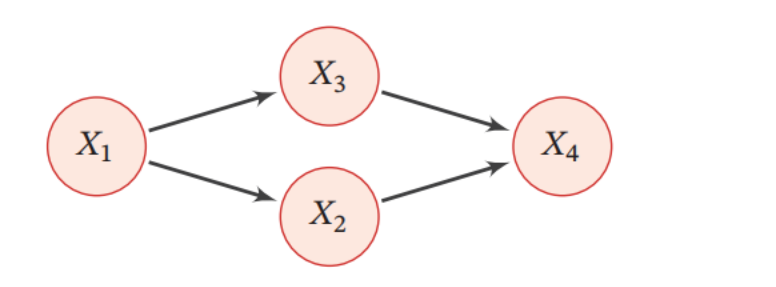

# 概率图

==概率图模型==（Probabilistic Graphical Model，PGM），简称图模型（Graphical Model，GM），是指一种用图结构来描述多元随机变量之间条件独立关系的概率模型，从而给研究高维空间中的概率模型带来了很大的便捷性．

对于一个 $K$ 维随机向量 $\boldsymbol{X}=\left[X_1, X_2, \cdots, X_K\right]^{\top}$, 其联合概率为高维空间中的分布, 一般难以直接建模. 假设每个变量为离散变量并有 $M$ 个取值, 在不作任何独立假设条件下, 则需要 $M^K-1$ 个参数才能表示其概率分布. 当 $M=2, K=100$时, 参数量约为 $10^{30}$, 远远超出了目前计算机的存储能力.

一种有效减少参数量的方法是独立性假设. 一个 $K$ 维随机向量 $\boldsymbol{X}$ 的联合概率分解为 $K$ 个条件概率的乘积,
$$
\begin{aligned}
p(\boldsymbol{x}) & \triangleq P(\boldsymbol{X}=\boldsymbol{x}) \\
& =\prod_{k=1}^K p\left(x_k \mid x_1, \cdots, x_{k-1}\right),
\end{aligned}
$$
其中 $x_k$ 表示变量 $X_k$ 的取值. 如果某些变量之间存在条件独立, 其参数量就可以大幅减少.

假设有四个二值变量 $X_1, X_2, X_3, X_4$, 在不知道这几个变量依赖关系的情况下, 可以用一个联合概率表来记录每一种取值的概率 $p\left(\boldsymbol{x}_{1: 4}\right)$, 共需要 $2^4-1=15$个参数. 假设在已知 $X_1$ 时, $X_2$ 和 $X_3$ 独立, 即有
$$
\begin{aligned}
& p\left(x_2 \mid x_1, x_3\right)=p\left(x_2 \mid x_1\right), \\
& p\left(x_3 \mid x_1, x_2\right)=p\left(x_3 \mid x_1\right) .
\end{aligned}
$$
在已知 $X_2$ 和 $X_3$ 时, $X_4$ 也和 $X_1$ 独立, 即有
$$
p\left(x_4 \mid x_1, x_2, x_3\right)=p\left(x_4 \mid x_2, x_3\right)
$$

那么其联合概率 $p(\boldsymbol{x})$ 可以分解为
$$
\begin{aligned}
p(\boldsymbol{x}) & =p\left(x_1\right) p\left(x_2 \mid x_1\right) p\left(x_3 \mid x_1, x_2\right) p\left(x_4 \mid x_1, x_2, x_3\right) \\
& =p\left(x_1\right) p\left(x_2 \mid x_1\right) p\left(x_3 \mid x_1\right) p\left(x_4 \mid x_2, x_3\right)
\end{aligned}
$$

即 4 个局部条件概率的乘积. 如果分别用 4 个表格来记录这 4 个条件概率的话, 只需要 $1+2+2+4=9$ 个独立参数，计算过程如下：
::: details 计算过程：

我们将分别计算每个条件概率所需的参数数量，并将它们相加以得到总数。首先，让我们确定每个条件概率所需的参数。

1. $p(x_1)$: 这是一个二值变量，所以它可以取两个值（比如0或1）。但是，由于概率总和必须为1，我们只需要知道其中一个值（例如$p(x_1=0)$），就可以推断出另一个值（$p(x_1=1)=1-p(x_1=0)$）。因此，$p(x_1)$只需要1个参数。

2. $p(x_2|x_1)$: 这是一个条件概率，$X_2$也是二值变量，而且它的概率依赖于$X_1$的值。对于$X_1$的每个值，$X_2$都有一个概率分布，所以我们需要2个值（$p(x_2=0|x_1=0)$和$p(x_2=0|x_1=1)$）来描述这个条件概率。但是，对于每个$X_1$的值，只需要知道$X_2$的一个值的条件概率，因为另一个可以通过1减去已知的条件概率来得到。所以，$p(x_2|x_1)$需要2个参数。

3. $p(x_3|x_1)$: 这个条件概率与$p(x_2|x_1)$类似，因为$X_3$也是二值变量，并且它的概率只依赖于$X_1$的值。因此，$p(x_3|x_1)$也需要2个参数。

4. $p(x_4|x_2, x_3)$: 这是一个条件概率，$X_4$的概率依赖于$X_2$和$X_3$的组合。由于$X_2$和$X_3$都是二值变量，所以有4种组合（00、01、10、11）。对于每种组合，我们需要知道$X_4$的一个值的概率，因为另一个值的概率可以通过1减去已知的概率来得到。因此，$p(x_4|x_2, x_3)$需要4个参数。

现在，我们将这些参数加起来得到总数：$1 + 2 + 2 + 4 = 9$,所以，总共需要9个参数来描述这个系统的联合概率分布。

:::

当概率模型中的变量数量比较多时, 其条件依赖关系也比较复杂. 我们可以使用图结构的方式将概率模型可视化, 以一种直观、简单的方式描述随机变量之间的条件独立性, 并可以将一个复杂的联合概率模型分解为一些简单条件概率模型的组合. 图11.1给出了上述例子中 4 个变量之间的条件独立性的图形化描述. 图中每个节点表示一个变量, 每条连边表示变量之间的依赖关系.

## **图模型的基本问题** 

图模型有三个基本问题：

1. 表示问题：对于一个概率模型，如何通过图结构来描述变量之间的依

赖关系．

2. 学习问题：图模型的学习包括图结构的学习和参数的学习．在本章中，

我们只关注在给定图结构时的参数学习，即参数估计问题．

3. 推断问题：在已知部分变量时，计算其他变量的条件概率分布．

## **图模型与机器学习** 

很多机器学习模型都可以归结为概率模型，即建模输入和输出之间的条件概率分布．因此，图模型提供了一种新的角度来解释机器学习模型，并且这种角度有很多优点，比如了解不同机器学习模型之间的联系，方便设计新模型等．在机器学习中，图模型越来越多地用来设计和分析各种学习算法．

