```

headerDepth: 2
sidebar: heading

```


# 模型表示

图由一组节点和节点之间的边组成．在概率图模型中，每个节点都表示一个==随机变量（或一组随机变量）==，边表示这些随机变量之间的==概率依赖关系==．

常见的概率图模型可以分为两类: ==有向图模型==和==无向图模型==.

1. 有向图模型使用有向非循环图 (Directed Acyclic Graph, DAG) 来描述变量之间的关系. 如果两个节点之间有连边, 表示对应的两个变量为因果关系,即不存在其他变量使得这两个节点对应的变 量条件独立.
2.  无向图模型使用无向图 (Undirected Graph) 来描述变量之间的关系.每条边代表两个变量之间有概率依赖关系, 但是并不一定是因果关系.

图1给出了两个代表性图模型 (有向图和无向图) 的示例, 分别表示了四个变量 $\left\{X_1, X_2, X_3, X_4\right\}$ 之间的依赖关系. ==图中带阴影的节点表示可观测到的变量, 不带阴影的节点表示隐变量==,连边表示两变量间的条件依赖关系.

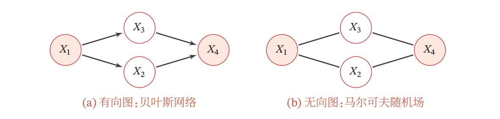

## **有向图模型**

==有向图模型==（Directed Graphical Model），也称为==贝叶斯网络==（BayesianNetwork）或==信念网络==（Belief Network，BN），是一类用有向图来描述随机向量概率分布的模型．

下图中 $x_j$表示 $x_i$ 的父类：

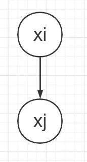

::: info 定义（贝叶斯网络）

对于一个 $K$ 维随机向量 $\boldsymbol{X}$ 和一个有 $K$ 个节点的有向非循环图 $G, G$ 中的每个节点都对应一个随机变量, 每个连接 $e_{i j}$ 表示两个随机变量 $X_i$ 和 $X_j$ 之间具有非独立的因果关系. 令 $\boldsymbol{X}_{\pi_k}$ 表示变量 $X_k$ 的所有父节点变量集合, $P\left(X_k \mid \boldsymbol{X}_{\pi_k}\right)$ 表示每个随机变量的局部条件概率分布 ( Local Conditional Probability Distribution). 如果 $\boldsymbol{X}$ 的联合概率分布可以分解为每个随机变量 $X_k$ 的局部条件概率的连乘形式, 即
$$
p(\boldsymbol{x})=\prod_{k=1}^K p\left(x_k \mid \boldsymbol{x}_{\pi_k}\right),
$$

那么 $(G, \boldsymbol{X})$ 构成了一个贝叶斯网络.

:::

因此可以根据有向图写出因子分解的结果。以下，有三种情况：

1. **共因关系（tail2tail）**

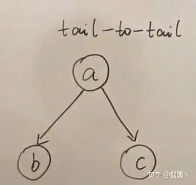

可以写出其因子分解的结果：
$$
P(a, b, c)=P(a) P(b \mid a) P(c \mid a)
$$

同时我们可以根据链式法则写出联合概率:
$$
P(a, b, c)=P(a) P(b \mid a) P(c \mid a, b)
$$

因此:
$$
\begin{aligned}
P(a) P(b \mid a) P(c \mid a) & =P(a) P(b \mid a) P(c \mid a, b) \\
P(c \mid a) & =P(c \mid a, b) \\
P(c \mid a) P(b \mid a) & =P(c \mid a, b) P(b \mid a) \\
P(c \mid a) P(b \mid a) & =P(b, c \mid a)
\end{aligned}
$$

所以可知: $b$ 与 $c$ 独立 (在 $a$ 已知的条件下)

若 $a$ 被观测，则路径被堵塞，即 $b$ 与 $c$ 独立 $c \perp b \mid a$

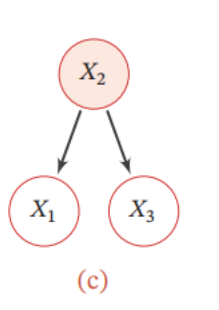

::: warning

此规则并不是强加上去的，是我们用概率图的因子分解表示联合概率后，本身存在的现象，我们在证明此现象存在后，总结出的规律，根据此规律可以直接看图得出结论。

:::

2. **间接因果关系（head2tail）**

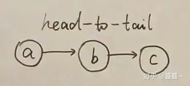

如图可以写出其因子分解的结果：
$$
P(a, b, c)=P(a) P(b \mid a) P(c \mid b)
$$

同时我们可以根据链式法则写出联合概率:
$$
P(a, b, c)=P(a) P(b \mid a) P(c \mid a, b)
$$

因此:
$$
\begin{aligned}
P(a) P(b \mid a) P(c \mid b) & =P(a) P(b \mid a) P(c \mid a, b) \\
P(c \mid b) & =P(c \mid a, b) \\
P(c \mid b) P(a \mid b) & =P(c \mid a, b) P(a \mid b) \\
P(c \mid b) P(a \mid b) & =P(a, c \mid b)
\end{aligned}
$$

所以可知： $a$ 与 $c$ 独立 (在 $b$ 已知的条件下) 从 $b$ 的角度来看，是 $a$ 的头和 $c$ 的尾巴相连，所以称为head-to-tail

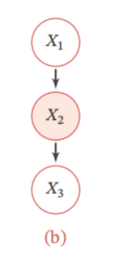

3. **共果关系（head2head)**

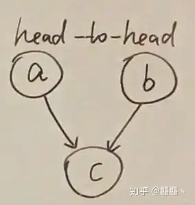

如图可以写出其因子分解的结果:
$$
P(a, b, c)=P(a) P(b) P(c \mid a, b)
$$

同时我们可以根据链式法则写出联合概率:
$$
P(a, b, c)=P(a) P(b \mid a) P(c \mid a, b)
$$

因此:
$$
\begin{aligned}
P(a) P(b) P(c \mid a, b) & =P(a) P(b \mid a) P(c \mid a, b) \\
P(b) & =P(b \mid a) \\
P(b) P(a) & =P(b \mid a) P(a) \\
P(a) P(b) & =P(a, b)
\end{aligned}
$$

所以可知: $a$ 与 $b$ 独立 (在 $c$ 不知的情况下)

由此，我们可以总结一个规律：

从 $c$ 的角度来看，是 $a$ 的头和 $b$ 的头相连，所以称为head-to-head 默认情况下， $a \perp b$ ，路径是阻塞的

特殊情况：若 $c$ 被观测，则路径是通的， $a$ 和 $b$ 不独立

这种情况中，在给定 $c$ 时， $a$ 和 $b$ 反而不独立了，与前两种情况刚好相反，我们举个例子说明一下:

::: important 局部马尔可夫性质

局部马尔可夫性质 对一个更一般的贝叶斯网络, 其局部马尔可夫性质为: 每个随机变量在给定父节点的情况下, 条件独立于它的非后代节点.
$$
X_k \perp Z \mid X_{\pi_k},
$$

其中 $Z$ 为 $X_k$ 的非后代变量.

:::


## 常见的有向图模型

很多经典的机器学习模型可以使用有向图模型来描述，比如朴素贝叶斯分类器、隐马尔可夫模型、深度信念网络等．

### Sigmoid信念网络

为了减少模型参数，可以使用==参数化模型==来建模有向图模型中的==条件概率分布==．一种简单的参数化模型为Sigmoid信念网络[^1]

==Sigmoid 信念网络== (Sigmoid Belief Network, SBN) 中的变量取值为 $\{0,1\}$.对于变量 $X_k$ 和它的父节点集合 $\pi_k$, 其条件概率分布表示为
$$
p\left(x_k=1 \mid \boldsymbol{x}_{\pi_k} ; \theta\right)=\sigma\left(\theta_0+\sum_{x_i \in x_{\pi_k}} \theta_i x_i\right),
$$

其中 $\sigma(\cdot)$ 是 Logistic 函数, $\theta_i$ 是可学习的参数. 假设变量 $X_k$ 的父节点数量为 $M$,如果使用表格来记录条件概率需要 $2^M$ 个参数, 如果使用参数化模型只需要 $M+$ 1 个参数. 如果对不同的变量的条件概率都共享使用一个参数化模型, 其参数数量又可以大幅减少.

值得一提的是, Sigmoid 信念网络与 Logistic 回归模型都采用 Logistic 函数来计算条件概率. 如果假设 Sigmoid 信念网络中只有一个叶子节点, 其所有的父节点之间没有连接, 且取值为实数, 那么 Sigmoid 信念网络的网络结构和 Logistic 回归模型类似, 如图11.4所示. 但是, 这两个模型的区别在于, Logistic 回归模型中的 $\boldsymbol{x}$ 作为一种确定性的参数, 而非变量. 因此, Logistic 回归模型只建模条件概率 $p(y \mid \boldsymbol{x})$, 是一种判别模型; 而 Sigmoid 信念网络建模联合概率 $p(\boldsymbol{x}, y)$, 是一种生成模型.

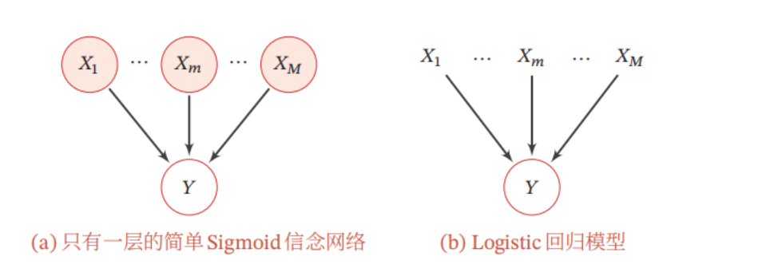

### **朴素贝叶斯分类器**

==朴素贝叶斯 ( Naive Bayes, NB)== 分类器是一类简单的概率分类器, 在强 (朴素 ) 独立性假设的条件下运用贝叶斯公式来计算每个类别的条件概率.
给定一个有 $M$ 维特征的样本 $\boldsymbol{x}$ 和类别 $y$, 类别 $y$ 的条件概率为
$$
\begin{aligned}
p(y \mid \boldsymbol{x} ; \theta) & =\frac{p\left(x_1, \cdots, x_M \mid y ; \theta\right) p(y ; \theta)}{p\left(x_1, \cdots, x_M\right)} \\
& \propto p\left(x_1, \cdots, x_M \mid y ; \theta\right) p(y ; \theta),
\end{aligned}
$$


其中 $\theta$ 为概率分布的参数.
在朴素贝叶斯分类器中, 假设在给定 $Y$ 的情况下, $X_m$ 之间是条件独立的, 即 $X_m \perp X_k \mid Y, \forall m \neq k$. 下图给出了朴素贝叶斯分类器的图模型表示.


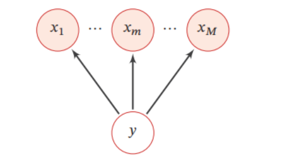

条件概率分布 $p(y \mid \boldsymbol{x})$ 可以分解为
$$
p(y \mid x ; \theta) \propto p\left(y \mid \theta_c\right) \prod_{m=1}^M p\left(x_m \mid y ; \theta_m\right),
$$

其中 $\theta_c$ 是 $y$ 的先验概率分布的参数, $\theta_m$ 是条件概率分布 $p\left(x_m \mid y ; \theta_m\right)$ 的参数. 若 $x_m$ 为连续值, $p\left(x_m \mid y ; \theta_m\right)$ 可以用高斯分布建模; 若 $x_m$ 为离散值, $p\left(x_m \mid y ; \theta_m\right)$ 可以用多项分布建模.

虽然朴素贝叶斯分类器的条件独立性假设太强, 但是在实际应用中, 朴素贝叶斯分类器在很多任务上也能得到很好的结果, 并且模型简单, 可以有效防止过拟合.


### **隐马尔可夫模型**

==隐马尔可夫模型== ( Hidden Markov Model, HMM ) [Baum et al., 1966] 是用来表示一种含有隐变量的马尔可夫过程.

图11.6给出隐马尔可夫模型的图模型表示, 其中 $X_{1: T}$ 为可观测变量, $Y_{1: T}$ 为隐变量. 所有的隐变量构成一个马尔可夫链, 每个可观测标量 $X_t$ 依赖当前时刻的隐变量 $Y_t$.

隐马尔可夫模型的联合概率可以分解为
$$
p(\boldsymbol{x}, \boldsymbol{y} ; \theta)=\prod_{t=1}^T p\left(y_t \mid y_{t-1}, \theta_s\right) p\left(x_t \mid y_t, \theta_t\right),
$$

为了描述方便, 这里用 $p\left(y_1 \mid y_0\right)$ 表示 $p\left(y_1\right)$.

其中 $\boldsymbol{x}$ 和 $\boldsymbol{y}$ 分别为可观测变量和隐变量的取值, 条件概率 $p\left(x_t \mid y_t, \theta_t\right)$ 称为==输出概率==, 条件概率 $p\left(y_t \mid y_{t-1}, \theta_s\right)$ 称为==转移概率==, $\theta_s$ 和 $\theta_t$ 分别表示两类条件概率的参数.

## 无向图模型


==无向图模型==，也称为==马尔可夫随机场==（Markov Random Field，MRF）或马尔可夫网络（Markov Network），是一类用==无向图==来描述一组具有局部马尔可夫性质的随机向量 $X$ 的联合概率分布的模型．

:::info 定义（马尔可夫随机场）

对于一个随机向量 $\boldsymbol{X}=\left[X_1, \cdots, X_K\right]^{\top}$ 和一个有 $K$ 个节点的无向图 $G(\mathcal{V}, \mathcal{E})$ ( 可以存在循环), 图 $G$ 中的节点 $k$ 表示随机变量 $X_k, 1 \leq k \leq K$. 如果 $(G, X)$ 满足局部马尔可夫性质, 即一个变量 $X_k$ 在给定它的邻居的情况下独立于所有其他变量,
$$
p\left(x_k \mid \boldsymbol{x}_{\backslash k}\right)=p\left(x_k \mid \boldsymbol{x}_{\mathcal{N}(k)}\right),
$$

其中 $\mathcal{N}(k)$ 为变量 $X_k$ 的邻居集合, $\backslash k$ 为除 $X_k$ 外其他变量的集合, 那么 $(G, X)$ 就构成了一个马尔可夫随机场.


:::

向图中的==局部马尔可夫性质==可以表示为
$$
X_k \perp \boldsymbol{X}_{\backslash\mathcal{N}(k), \backslash k} \mid \boldsymbol{X}_{\mathcal{N}(k)},
$$

其中 $\boldsymbol{X}_{ \backslash\mathcal{N}(k),\backslash k}$ 表示除 $\boldsymbol{X}_{\mathcal{N}(k)}$ 和 $X_k$ 外的其他变量.
对于图中的 $4$ 个变量, 根据马尔可夫性质, 可以得到 $X_1 \perp X_4 \mid X_2, X_3$ 和 $X_2 \perp X_3 \mid X_1, X_4$

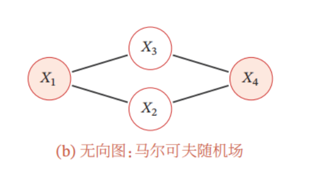


### **无向图模型的概率分解**

::: info 团

由于无向图模型并不提供一个变量的拓扑顺序, 因此无法用链式法则对 $p(x)$ 进行逐一分解. 无向图模型的联合概率一般以全连通子图为单位进行分解.无向图中的一个全连通子图, 称为团 (Clique), 即团内的所有节点之间都连边.在下图所示的无向图中共有 7 个团, 包括 $\left\{X_1, X_2\right\},\left\{X_1, X_3\right\},\left\{X_2, X_3\right\},\left\{X_3, X_4\right\}$, $\left\{X_2, X_4\right\},\left\{X_1, X_2, X_3\right\},\left\{X_2, X_3, X_4\right\}$.

在所有团中, 如果一个团不能被其他的团包含, 这 个团就是一个==最大团== ( Maximal Clique).

:::

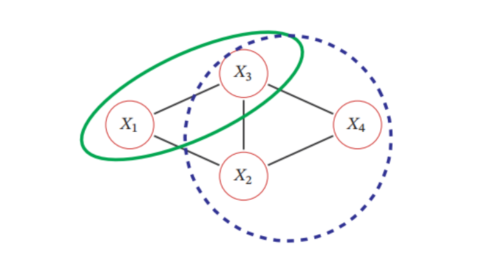

无向图中的联合概率可以分解为一系列定义在最大团上的非负函数的乘积形式．


::: important Hammersley-Clifford定理

如果一个分布 $p(\boldsymbol{x})>0$ 满足无向图 $G$ 中的局部马尔可夫性质, 当且仅当 $p(\boldsymbol{x})$ 可以表示为一系列定义在最大团上的非负函数的乘积形式, 即
$$
\begin{equation}
\label{gibbs}
p(\boldsymbol{x})=\frac{1}{Z} \prod_{c \in \mathcal{C}} \phi_c\left(\boldsymbol{x}_c\right),
\end{equation}
$$

其中 $\mathcal{C}$ 为 $G$ 中的最大团集合, $\phi_c\left(\boldsymbol{x}_c\right) \geq 0$ 是定义在团 $c$ 上的==势能函数== (Potential Function ), $Z$ 是==配分函数== (Partition Function), 用来将乘积归一化为概率形式:
$$
Z=\sum_{x \in X} \prod_{c \in \mathcal{C}} \phi_c\left(\boldsymbol{x}_c\right)
$$

其中 $x$ 为随机向量 $X$ 的取值空间.

:::

Hammersley-Clifford 定理的证明可以参考 [^2]．无向图模型与有向图模型的一个重要区别是有配分函数𝑍．配分函数的计算复杂度是指数的，因此在推断和参数学习时都需要重点考虑．

::: info 吉布斯分布

公式 $\ref{gibbs}$ 中定义的分布形式也称为吉布斯分布（Gibbs Distribution）．根据 Hammersley-Clifford 定理，无向图模型和吉布斯分布是一致的．吉布斯分布一定满足马尔可夫随机场的条件独立性质，并且马尔可夫随机场的概率分布一定可以表示成吉布斯分布．

:::

由于势能函数必须为正,因此我们一般定义为
$$
\phi_c\left(\boldsymbol{x}_c\right)=\exp \left(-E_c\left(\boldsymbol{x}_c\right)\right),
$$

其中 $E_c\left(\boldsymbol{x}_c\right)$ 为==能量函数== (Energy Function).

因此,无向图上定义的概率分布可以表示为
$$
\begin{equation}
\label{boltz}
\begin{aligned}
P(\boldsymbol{x}) & =\frac{1}{Z} \prod_{c \in \mathcal{C}} \exp \left(-E_c\left(\boldsymbol{x}_c\right)\right) \\
& =\frac{1}{Z} \exp \left(\sum_{c \in \mathcal{C}}-E_c\left(\boldsymbol{x}_c\right)\right) .
\end{aligned}
\end{equation}
$$

这种形式的分布又称为玻尔兹曼分布 (Boltzmann Distribution). 任何一个无向图模型都可以用公式 $\ref{boltz}$ 来表示其联合概率.

## 常见的无向图模型

很多经典的机器学习模型可以使用无向图模型来描述，比如对数线性模型（也叫最大熵模型）、条件随机场、玻尔兹曼机、受限玻尔兹曼机等．

### 对数线性模型

势能函数一般定义为
$$
\phi_c\left(\boldsymbol{x}_c \mid \theta_c\right)=\exp \left(\theta_c^{\top} f_c\left(\boldsymbol{x}_c\right)\right),
$$

其中函数 $f_c\left(\boldsymbol{x}_c\right)$ 为定义在 $\boldsymbol{x}_c$ 上的特征向量, $\theta_c$ 为权重向量. 这样联合概率 $p(\boldsymbol{x})$的对数形式为
$$
\log p(\boldsymbol{x} ; \theta)=\sum_{c \in \mathcal{C}} \theta_c^{\top} f_c\left(\boldsymbol{x}_c\right)-\log Z(\theta),
$$

其中 $\theta$ 代表所有势能函数中的参数 $\theta_c$. 这种形式的无向图模型也称为对数线性模型 ( Log-Linear Model) 或最大熵模型 (Maximum Entropy Model) [Berger et al., 1996; Della Pietra et al., 1997]. 图11.8a所示是一个常用的最大熵模型.
如果用对数线性模型来建模条件概率 $p(y \mid \boldsymbol{x})$,
$$
p(y \mid \boldsymbol{x} ; \theta)=\frac{1}{Z(\boldsymbol{x} ; \theta)} \exp \left(\theta^{\top} f(\boldsymbol{x}, y)\right),
$$

其中 $Z(\boldsymbol{x} ; \theta)=\sum_y \exp \left(\theta^{\top} f_{\boldsymbol{y}}(\boldsymbol{x}, y)\right)$.
对数线性模型也称为条件最大熵模型或Softmax 回归模型.

### 条件随机场

## 有向图和无向图直接的转换


## 参考

[^1]: [PII: 0004-3702(92)90065-6 (toronto.edu)](https://www.cs.toronto.edu/~bonner/courses/2016s/csc321/readings/Connectionist learning of belief networks.pdf)
[^2]: Koller D, Friedman N, 2009. Probabilistic graphical models: principles and techniques[M]. MITpress.

