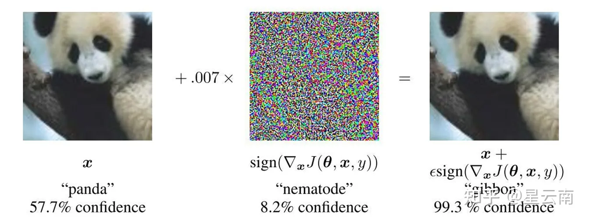

# 对抗攻击

## 基本概念

深度学习中的神经网络在精心训练后，其分类准确性可以非常出色，但其的鲁棒性却可能很差，可能会轻易被对抗攻击打破。即通过对输入图片进行一个微小的扰动，就可以在几乎肉眼看不出差距的前提下，让神经网络的分类准确率大幅下降。

## 对抗鲁棒性

【金山文档】 PGD
https://kdocs.cn/l/csBKPtHtET4R

## 对抗攻击的分类

- 白箱攻击（white-box attack）：在白箱攻击中攻击者知道目标模型的所有信息，包括模型的训练集、类型、结构以及参数。
- 黑箱攻击（black-box attack）：在黑箱攻击中，攻击者不知道目标模型的内部细节，只能够观察目标模型对输入样本的输出结果。
- 定向攻击（target attack）：对于一个多分类网络，把输入分类误判到一个某个**特定的错误类别上**
- 非定向攻击（non-target attack）：只需要生成对抗样本，可以引入**任意一个**错误类别

## FGSM

白盒非指向性

[论文地址](https://arxiv.org/abs/1412.6572)

[对抗样本（三）FGSM | BaiDing's blog (baidinghub.github.io)](https://baidinghub.github.io/2020/04/03/对抗样本（三）FGSM/#一、论文相关信息)

[对抗攻击篇：FGSM 与 PGD 攻击算法 | Just for Life. (muyuuuu.github.io)](https://muyuuuu.github.io/2021/04/26/DNN-safe-basic/)

### 简介

早期对对抗样本产生的原因的猜测集中于神经网络的非线性性和过拟合, 但是这篇论文证明神经网络的线性性质是造成神经网络具有对抗样本的主要原因. 同时, 该篇论文提出了一个能供更简单与更快速的生成对抗样本的方法。

### 对抗样本的线性解释

我们知道，输入图像通常都是8bits的，这也就丟失了输入图像的1/255之间的信息。而如果对抗扰动足够小的话，是会被忽略的，因此作者猜测，是由于模型的线性所导致的。作者通过数学公式来解释。一个网络模型的权重为 $w^T$
$$
w^T \tilde{x}=w^T x+w^T \eta
$$

对抗扰动让网络的激励增加了 $w^T \eta$ ，我们只要将 $\eta=\operatorname{sign}(w)$ ，就可以最大化的增加模型的激励，当 $w^T$ 具有 $n$ 维，平均权重值为 $m$ ，那么激励就会增长 $\epsilon m n\left(\|\eta\|_{\infty}<\epsilon\right)$ ，但是 $\|\eta\|_{\infty}$ 却并不会因为维度的增加而增加，这样，当我们增加一个很小的扰动的时候，就会产生很大的改变。这被称为"accidental steganography"，这种隐藏术的意思是，一个线性模型被迫只关注与权重相接近的信号，却会忽略那些权重大但不相关的振幅(像素点)。

上述的解释说明，==对一个简单的线性网络来说，如果他的输入有着足够的维度，那么他就会有对抗样本==。先前对对抗样本的解释引用了了神经网络的假设特性，例如它们假定的高度非线性性质。我们基于线性的假设更简单，也可以解释为什么 softmax回归容易受到对抗性例子的影响。

### 非线性模型的线性扰动

从对抗样本的线性视角来看，我们得出了一个很快的生成对抗样本的方法。我们假设神经网络是十分线性的。

我们已知的一些模型，LSTM、ReLU、maxout网络都是被设计用线性的方式来运作的，所以比较容易优化，而非线性的模型，比如Sigmoid网络，我们会很难优化。但是线性，会让模型更容易受到攻击。

模型的参数设为 $\theta ， x$ 记为模型的输入， $y$ 记为模型得到的标签， $J(\theta, x, y)$ 记为神经网络使用的损失函数，同门可以通过以下的公式来得到对抗扰动:
$$
\eta=\epsilon \operatorname{sign}\left(\nabla_x J(\theta, x, y)\right)
$$

我们把这个叫做FGSM (fast gradient sign method)

损失函数 $J(\theta, \boldsymbol{x}, y)$ 衡量了网络预测 $\boldsymbol{x}$ 时的错误程度，其中 $\theta$ 是网络参数，$y$ 是真实标签。当我们计算这个损失函数关于输入 $\boldsymbol{x}$ 的梯度时，$\nabla_{\boldsymbol{x}} J(\theta, \boldsymbol{x}, y)$ 指示了哪个方向的微小变化会导致损失最大的增加。

在机器学习中，梯度的数学定义告诉我们在多维空间中函数增长最快的方向。具体来说，对于一个可微分函数 $f(\boldsymbol{x})$，其在点 $\boldsymbol{x}$ 处的梯度 $\nabla f(\boldsymbol{x})$ 指向函数值增长最快的方向。这是梯度的基本性质。

现在，我们来形式化这个直觉：

假设我们有一个小的扰动 $\Delta \boldsymbol{x}$ 加到输入 $\boldsymbol{x}$ 上，损失函数 $J$ 在 $\boldsymbol{x}$ 处的一阶泰勒展开大约为：

$$
J(\theta, \boldsymbol{x} + \Delta \boldsymbol{x}, y) \approx J(\theta, \boldsymbol{x}, y) + \nabla_{\boldsymbol{x}} J(\theta, \boldsymbol{x}, y)^\top \Delta \boldsymbol{x}
$$

为了最大化损失增量，我们希望 $\nabla_{\boldsymbol{x}} J(\theta, \boldsymbol{x}, y)^\top \Delta \boldsymbol{x}$ 尽可能大。根据柯西-施瓦茨不等式（Cauchy-Schwarz inequality），两个向量的点积的最大值是当它们是平行时取得的，即：

$$
\nabla_{\boldsymbol{x}} J(\theta, \boldsymbol{x}, y)^\top \Delta \boldsymbol{x} \leq \|\nabla_{\boldsymbol{x}} J(\theta, \boldsymbol{x}, y)\| \|\Delta \boldsymbol{x}\|
$$

等号成立当且仅当 $\Delta \boldsymbol{x}$ 是 $\nabla_{\boldsymbol{x}} J(\theta, \boldsymbol{x}, y)$ 的正比例，因此，损失增加最快的方向就是梯度的方向。

然而，我们通常希望对输入的扰动 $\Delta \boldsymbol{x}$ 有一个大小限制，以确保扰动是微小的。FGSM 通过选择 $\Delta \boldsymbol{x} = \epsilon \cdot \operatorname{sign}(\nabla_{\boldsymbol{x}} J(\theta, \boldsymbol{x}, y))$ 来实现这一点，其中 $\epsilon$ 是一个小常数。这样，每个元素的扰动都受到限制，并且整个扰动的 $\ell_\infty$ 范数不超过 $\epsilon$。

因此，$\eta = \epsilon \cdot \operatorname{sign}(\nabla_{\boldsymbol{x}} J(\theta, \boldsymbol{x}, y))$ 是在给定大小限制下，使得损失函数增加最快的方向。这就是为什么 FGSM 使用这种特定形式的扰动来生成对抗样本的原因。

这个公式是快速梯度符号方法（Fast Gradient Sign Method, 简称 FGSM）的核心，它是一种生成对抗性样本的技术。这个方法由 Ian Goodfellow 等人在 2014 年提出，旨在通过执行单步梯度更新来生成对抗性样本，具体来说是沿着使损失最大化的方向。

在这个公式中：

- $\epsilon$ 是一个小的扰动量，它控制了对抗性扰动的强度。
- $\nabla_x J(\theta, x, y)$ 是损失函数 $J$ 关于输入 $x$ 的梯度，这里 $\theta$ 表示模型参数，$x$ 表示输入样本，$y$ 表示目标输出。
- $\operatorname{sign}(\cdot)$ 函数取梯度的符号，为每个元素返回 $+1$ 或 $-1$（或 $0$，如果梯度为零）。

FGSM 的设计基于以下直觉：

1. **梯度方向**：损失函数的梯度指向了损失增加最快的方向。在对抗性攻击的背景下，目标是找到一个小的扰动 $\eta$，使得当它加到输入样本 $x$ 上时，会导致模型的损失增加，从而降低模型的性能。

2. **符号函数**：使用 $\operatorname{sign}(\cdot)$ 函数是为了得到一个大小为 $\epsilon$ 的扰动，而不是直接使用梯度值。这确保了每个元素的扰动都是等量的，并且扰动的 $\ell_\infty$ 范数（无穷范数，即向量中的最大元素）不超过 $\epsilon$。这样的扰动通常很小，对人类的感知影响不大，但足以欺骗神经网络。

3. **效率**：FGSM 是一种快速而简单的方法，因为它只需要计算一次输入 $x$ 的梯度，然后应用符号函数和扰动系数 $\epsilon$。这使得 FGSM 成为一种计算高效的对抗性攻击方法，尤其适合于生成大量对抗性样本。

FGSM 生成的对抗性样本可以用来测试模型的鲁棒性或用于对抗性训练，后者是一种通过在训练过程中引入对抗性样本来提高模型鲁棒性的方法。

 作者在使用中，使用了 $\epsilon=0.25$ ，在MINST测试集上，对softmax分类器攻击达到了99.9%的攻击成功率，平均置信度为79.3%。使用相同的配置，对maxout网络，能达到89.4%的攻击成功率，平均置信度为97.6%。当使用卷积maxout网络与CIFAR-10数据集时，使用$\epsilon=0.1$，达到了87.15%的攻击成功率，以及96.6%的平均置信度。同时，作者发现，使用其他的简单的方法也可以产生对抗样本，比如使x在梯度方向上旋转一定的角度，就可以产生对抗样本。

### **线性模型的对抗训练与权重衰减的对比研究**

## PGD

[[1706.06083\] Towards Deep Learning Models Resistant to Adversarial Attacks (arxiv.org)](https://arxiv.org/abs/1706.06083)