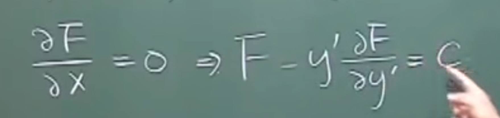
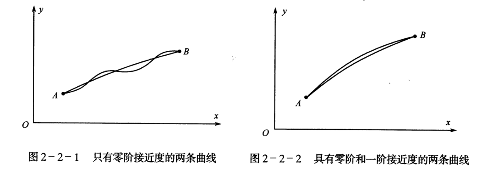

# 变分法

dsw2718314

$$
\mathcal{F}(f)=\int_{x_1}^{x_2} \mathcal{L}\left(x, f(x), f^{\prime}(x)\right) d t
$$

$$
\frac{\partial \mathcal{L}}{\partial f}-\frac{d}{d x}\left(\frac{\partial \mathcal{L}}{\partial f^{\prime}}\right)=0
$$

[Euler-Lagrange Equation (欧拉-拉格朗日方程)推导 - 知乎 (zhihu.com)](https://zhuanlan.zhihu.com/p/148949128)

[【变分计算1】欧拉-拉格朗日方程 - 知乎 (zhihu.com)](https://zhuanlan.zhihu.com/p/356288730)

许多数学物理问题都涉及到能够以积分形式表示的量的最小化或者最大化。比如说对于下图，同一平面内的两点 $(P 1, P_2)$ 之间的路径 $y(x)$ 有无数条，那么哪一条路径 $y(x)$ 能够使得两点之间的距离最小呢?

对于任意一条路径，比如图中的蓝色曲线，通过路径 $y(x)$ 连接的两点之间的距离可以通过积分来表示。将两点之间的 $x$ 区间分成很多个小的 $\Delta x$ ，对于一个 $\Delta x$ 区间（很小）上的弧长 $d s$ 可以近似成线段，那么弧长便可写为 $d s=\sqrt{(\Delta x)^2+(\Delta y)^2}=\Delta x \sqrt{1+\left(\frac{\Delta y}{\Delta x}\right)^2}$

其中 $\Delta x$ 很小时， $\frac{\Delta y}{\Delta x}=\frac{d y}{d x}=y_x$ ，其中 $y_x$ 表示 $y(x)$ 对 $x$ 的一阶导数。那么将所有 $\Delta x$ 区间内的弧长相加，便得到 $P 1, P 2$ 两点在路径上 $y$ 的距离为
$$
J(y)=\int_{x_1}^{x_2} \sqrt{1+y_x^2} d x
$$

因此固定的两点之间的距离实际上就是路径函数 $y$ 的泛函。函数代表了数到数的映射，而泛函代表了函数到数的映射，即给定一个函数，泛函能够得到一个数（比如此例中，如果取不同的路径 $y$ ，那么积分得到的结果 $J(y)$ 即距离也会不同）。问题就是要找到一个路径函数 $y$ 使得泛函 $J(y)$取极小值。

## 基本概念

#### 函数间的距离

设已知函数 $y_0(x)$ 在区间 $[a, b]$ 上有连续的 $n$ 阶导数, 则所有与
函数 $y_0(x)$ 在区间 $[a, b]$ 上的 $n$ 阶距离小于正数 $\delta$ 的函数 $y(x)$ 所组成的集合称为函数 $y_0(x)$ 在区间 $[a, b]$ 上的 $n$ 阶 $\delta$ 邻域或 ==$n$ 级 $\delta$ 邻域==, 记为 $N_n\left[\delta, y_0(x)\right]$, 可表示为
$$
N_n\left[\delta, y_0(x)\right]=\left\{y(x) \mid  y(x)\in C^n[a, b], d_n\left[y(x), y_0(x)\right]<\delta\right\}
$$

根据上述定义, 函数 $y_0(x)$ 的 $n$ 阶 $\delta$ 邻域内的任一函数 $y(x)$ 应在所讨论的区间内同时满足下列不等式
$$
\left|y(x)-y_0(x)\right|<\delta,\left|y^{\prime}(x)-y_0^{\prime}(x)\right|<\delta, \cdots,\left|y^{(n)}(x)-y_0^{(n)}(x)\right|<\delta
$$
函数 $y_0(x)$ 的零阶 $\delta$ 邻域由所有满足 $\left|y(x)-y_0(x)\right|<\delta$ 的函数 $y(x)$ 所组成。而函数 $y_0(x)$ 的一阶 $\delta$ 邻域则由所有满足 $\left|y(x)-y_0(x)\right|<\delta$ 和 $\left|y^{\prime}(x)-y_0^{\prime}(x)\right|<\delta$ 的函数 $y(x)$ 所组成。所以 $y_0(x)$ 的一阶 $\delta$ 邻域是 $y_0(x)$ 的零阶 $\delta$ 邻域的一部分。函数 $y_0(x)$ 的零阶 $\delta$ 邻域称为该函数的==强 $\delta$ 邻域====或强邻域==。函数 $y_0(x)$ 的一阶 $\delta$ 邻域称为该函数的==弱 $\delta$ 邻域或弱邻域==。显然函数的弱邻域是函数的强邻域的一部分。

曲线 $y=y(x)$ 的零阶 $\delta$ 邻域由所有位于 $y=y(x)$ 上下宽为 $2 \delta$ 的带状区域内的曲线组成。以上概念可以推广到多元函数的情形。
若 $y(x) \in N_n\left[\delta, y_0(x)\right]$, 则 $y(x)$ 与 $y_0(x)$ 称为具有 ==$n$ 阶的 $\delta$ 接近度==。

==若两曲线具有 $n$ 阶的 $\delta$ 接近度, 则它们具有任何低于 $n$ 阶的 $\delta$ 接近度。==接近度的阶数越高, 两曲线的接近程度就越近。例如图 2-2-1 是仅具有零阶接近度的两条曲线, 而下图是具有零阶和一阶接近度的两条曲线。有了接近度的概念可以精确地定义泛函的连续。

设函数 $y(x) \in F=C^n[a, b], J[y(x)]$ 是定义域为 $F$ 的泛函。若对于任意给定的一个正数 $\varepsilon$,总可以找到一个 $\delta>0$, 只要
$$
d_n\left[y(x), y_0(x)\right]<\delta, \text { 即 } \dot{y}(x) \in N_n\left[\delta, y_0(x)\right] \subset F
$$

都有
$$
\left|J[y(x)]-J\left[y_0(x)\right]\right|<\varepsilon
$$

成立, 则泛函 $J[y(x)]$ 称为在函数 $y_0(x)$ 处具有 ==$n$ 阶 $\delta$ 接近度的连续泛函。==

### 变分

对于任意定值 $x \in\left[x_0, x_1\right]$, 可取函数 $y(x)$ 与另一可取函数 $y_0(x)$ 之差 $y(x)-y_0(x)$ 称为函数 $y(x)$ 在 $y_0(x)$ 处的变分或函数的变分, 记作 $\delta y, \delta$ 称为变分记号、变分符号或变分算子, 这时有
$$
\delta y=y(x)-y_0(x)=\varepsilon \eta(x)
$$

式中 $\varepsilon$ 为拉格朗日引进的一个小参数, 但它不是 $x$ 的函数, 而 $\eta(x)$ 为 $x$ 的任意函数。由于可取函数都通过区间的固定端点, 即它们在区间的端点的值都相等, 故在区间的端点, 任意函数 $\eta(x)$ 都满足
$$
\eta\left(x_0\right)=\eta\left(x_1\right)=0
$$

也就是
$$
\begin{equation}
\label{def:var}
\delta y\left(x_0\right)=\delta y\left(x_1\right)=0
\end{equation}
$$
式 $\ref{def:var}$ 就是函数变分在固定端点应该满足的条件即固定边界条件。

因为可取函数 $y(x)$ 是泛函 $J[y(x)]$ 的变量, 故也可以这样定义变分: ==泛函的变量量 $y(x)$ 与另一宗量 $y_0(x)$ 之差 $y(x)-y_0(x)$ 称为宗量 $y(x)$ 在 $y_0(x)$ 处的变分。==

对于任意定值 $x \in\left[x_0, x_1\right]$, 若可取函数 $y(x)$ 与另一可取函数 $y_0(x)$ 具有零阶接近度, 则 $y(x)-y_0(x)$ 称为函数 $y(x)$ 在 $y_0(x)$ 处的==强变分==。若 $y(x)$ 与 $y_0(x)$ 具有一阶(或一阶以上) 接近度,则 $y(x)-y_0(x)$ 称为函数 $y(x)$ 在 $y_0(x)$ 处的==弱变分==。强变分与弱变分统称变分。

上述变分的定义也可以推广到多元函数的情形。

显然, 根据变分的定义, 函数 $y(x)$ 的变分 $\delta y$ 是 $x$ 的函数。注意函数变分 $\delta y$ 与函数增量 $\Delta y$ 的区别, 如图所示, 函数的变分 $\delta y$ 是两个不同函数 $y(x)$ 与 $y_0(x)$ 在自变量 $x$ 取固定值时之差 $\varepsilon \eta(x)$, 函数发生了改变; 函数的增量 $\Delta y$ 是由于自变量 $x$ 取一个增量而使同一函数 $y(x)$ 产生的增量, 函数仍是原来的函数。由此也可以看出变分符号 $\delta$ 的作用是用以表示相应于自变量 $x$ 取某一定值时函数的微小改变。

变分符号 $\delta$ 不仅可以表示当自变量 $x$ 取某一定值时函数的微小改变, 同样也可以表示当 $x$ 取某一定值时函数的导数的改变。如果函数 $y(x)$ 与另一函数 $y_0(x)$ 都可导, 则函数的变分 $\delta y$ 有以下性质
$$
\delta y^{\prime}=y^{\prime}(x)-y_0^{\prime}(x)=\left[y(x)-y_0(x)\right]^{\prime}=(\delta y)^{\prime}
$$

由此得到变分符号 $\delta$ 与导数符号 $\frac{\mathrm{d}}{\mathrm{d} x}$ 之间的关系
$$
\delta \frac{\mathrm{d} y}{\mathrm{~d} x}=\frac{\mathrm{d}}{\mathrm{d} x} \delta y
$$

即函数导数的变分等于函数变分的导数。换句话说, 求变分与求导数这两种运算次序可以交换。在进行变分法的有关推导时要经常用到变分的这个性质。
上面的性质可推广到高阶导数的变分情形, 即
$$
\delta y^{\prime \prime}=(\delta y)^{\prime \prime}, \delta y^{\prime \prime}=(\delta y)^{\prime \prime \prime}, \cdots, \delta y^{(n)}=(\delta y)^{(n)}
$$

$$
\delta y^{\prime}=(\delta y)^{\prime}=\varepsilon \eta^{\prime}(x)
$$

**哈密顿算子**
$$
\begin{gathered}
\delta \nabla \varphi=\delta \frac{\partial}{\partial x_i} \boldsymbol{e}_i \varphi \pm \frac{\partial}{\partial x_i} \boldsymbol{e}_i \delta \varphi=\nabla \delta \varphi \\
\delta \nabla \cdot \boldsymbol{a}=\delta \frac{\partial}{\partial x_i} \boldsymbol{e}_i \cdot a_j \boldsymbol{e}_j=\frac{\partial}{\partial x_i} \boldsymbol{e}_i \cdot \delta a_j \boldsymbol{e}_j=\frac{\partial}{\partial x_i} \boldsymbol{e}_i \cdot \delta \boldsymbol{a}=\nabla \cdot \delta \boldsymbol{a} \\
\delta \nabla \times \boldsymbol{a}=\delta \frac{\partial}{\partial x_i} \boldsymbol{e}_i \times a_{\boldsymbol{j}} \boldsymbol{e}_j=\frac{\partial}{\partial x_i} \boldsymbol{e}_i \times \delta a_j \boldsymbol{e}_j=\frac{\partial}{\partial x_i} \boldsymbol{e}_i \times \delta \boldsymbol{a}=\nabla \times \delta \boldsymbol{a}
\end{gathered}
$$
**拉布拉斯算子**

$$
\delta \Delta \varphi=\delta\left(\frac{\partial^2 \varphi}{\partial x^2}+\frac{\partial^2 \varphi}{\partial y^2}+\frac{\partial^2 \varphi}{\partial z^2}\right)=\frac{\partial^2 \delta \varphi}{\partial x^2}+\frac{\partial^2 \delta \varphi}{\partial y^2}+\frac{\partial^2 \hat{\delta} \varphi}{\partial z^2}=\left(\frac{\partial^2}{\partial x^2}+\frac{\partial^2}{\partial y^2}+\frac{\partial^2}{\partial z^2}\right) \delta \varphi=\Delta \delta \varphi
$$

## 最简泛函的变分

设 $F\left(x, y(x), y^{\prime}(x)\right)$ 是三个独立变量 $x, y(x), y^{\prime}(x)$ 在区间 $\left[x_0, x_1\right]$ 上的已知函数, 且二阶连续可微,其中 $y(x)$ 和 $y^{\prime}(x)$ 是 $x$ 的末知函数, 则泛函
$$
J[y(x)]=\int_{x_0}^{x_1} F\left(x, y(x) ; y^{\prime}(x)\right) \mathrm{d} x
$$

称为最简单的积分型泛函,简称==最简泛函==, 有时也称为价值泛函。泛函 $J[y(x)]$ 称为泛函形式或变分积分,被积函数 $F$ 称为泛函的核、变分被积函数或拉格朗日函数。因对 $F$ 的积分得到的 $J[y(x)]$值取决于函数 $y(x)$ 的形式, 故 $J[y(x)]$ 是 $y(x)$ 的泛函。$J[y(x)]$ 其实不仅仅只是 $y(x)$ 的函数, 而且还是 $x$ 和 $y^{\prime}(x)$ 的函数, 但只要求出了 $y(x), y^{\prime}(x)$ 也就能求出来了,于是只是写成 $J[y(x)]$ 的形式。

在 $y=y(x)$ 的一阶邻域内, 任取一曲线 $y=y_1(x)$, 则有
$$
\delta y=y_1(x)-y(x), \delta y^{\prime}=y_1^{\prime}(x)-y^{\prime}(x) .
$$

最简泛函 $J[y(x)]$ 的增量为
$$
\begin{aligned}
\Delta J= & J\left[y_1(x)\right]-J[y(x)]=J[y(x)+\delta y]-J[y(x)]= \\
& \int_{x_0}^{x_1} F\left(x, y+\delta y, y^{\prime}+\delta y^{\prime}\right) \mathrm{d} x-\int_{x_0}^{x_1} F\left(x, y, y^{\prime}\right) \mathrm{d} x= \\
& \int_{\dot{x}_0}^{x_1}\left[F\left(x, y+\delta y, y^{\prime}+\delta y^{\prime}\right)-F\left(x, y, y^{\prime}\right)\right] \mathrm{d} x
\end{aligned}
$$

有时泛函的增量也称为==泛函的全变分==。

由二元函数的泰勒中值定理得
$$
F\left(x, y+\delta y, y^{\prime}+\delta y^{\prime}\right)-F\left(x, y, y^{\prime}\right)=\bar{F}_y \delta y+\bar{F}_y \delta y^{\prime}
$$

式中, $\bar{F}_y$ 与 $\bar{F}_{y^{\prime}}$ 分别表示 $F_y$ 与 $F_{y^{\prime}}$ 在 $\left(x, \bar{y}(x), \bar{y}^{\prime}(x)\right)$ 处的值, $\bar{y}(x)$ 介于 $y(x)$ 与 $y_1(x)$ 之间, $\bar{y}^{\prime}(x)$介于 $y^{\prime}(x)$ 与 $y_1^{\prime}(x)$ 之间。因而.
$$
\begin{array}{lr}
|\bar{y}(x)-y(x)|<d_1\left[y_1(x), y(x)\right] &  \\
\left|\bar{y}^{\prime}(x)-y^{\prime}(x)\right|<d_1\left[y_1(x), y(x)\right] & 
\end{array}
$$

对于任意 $\varepsilon_1>0, \varepsilon_2>0$, 当 $d_1\left[y_1(x), y(x)\right]$ 充分小时, 必有
$$
\left|\bar{F}_y-F_y\right|<\varepsilon_1,\left|\bar{F}_{y^{\prime}}-F_{y^{\prime}}\right|<\varepsilon_2
$$

因此, 有
$$
\begin{aligned}
\Delta J= & \int_{x_0}^{x_1}\left(\bar{F}_y \delta y+\bar{F}_{y^{\prime}} \delta y^{\prime}\right) \mathrm{d} x= \\
& \int_{x_0}^{x_1}\left(F_y \delta y+F_{y^{\prime}} \delta y^{\prime}\right) \mathrm{d} x+\int_{x_0}^{x_1}\left[\left(\bar{F}_y-F_y\right) \delta y+\left(\bar{F}_{y^{\prime}}-F_{y^{\prime}}^{\prime}\right) \delta y^{\prime}\right] \mathrm{d} x = \\
& \int_{x_0}^{x_1}\left(F_y \delta y+F_{y^{\prime} \delta y^{\prime}}\right) \mathrm{d} x+\varepsilon d_1\left[y_1(x), y(x)\right]
\end{aligned}
$$

式中
$$
\varepsilon d_1\left[y_1(x), y(x)\right]=\int_{x_0}^{x_1}\left[\left(\bar{F}_y-F_y\right) \delta y+\left(\bar{F}_{y^{\prime}}-F_{y^{\prime}}\right) \delta y^{\prime}\right] \mathrm{d} x \quad
$$
且 $\varepsilon$ 随 $d_1\left[y_1(x), y(x)\right]$ 趋于零而趋于零。这是由于
$$
\begin{gathered}
\left|\int_{x_0}^{x_1}\left[\left(\bar{F}_y-F_y\right) \delta y+\left(\bar{F}_{y^{\prime}}-F_{y^{\prime}}\right) \delta y^{\prime}\right] \mathrm{d} x\right| \leqslant \\
\int_{x_0}^{x_1}\left|\bar{F}_y-F_y\right||\delta y| \mathrm{d} x+\int_{x_0^{\prime}}^{x_1}\left|\bar{F}_{y^{\prime}}-F_{y^{\prime}}\right|\left|\delta y^{\prime}\right| \mathrm{d} x< \\
\left(\varepsilon_1+\varepsilon_2\right) d_1\left[y_1(x), y(x)\right]\left(x_1-x_0\right)=\varepsilon^{\prime} d_1\left[y_1(x), y(x)\right]
\end{gathered}
$$

面 $\varepsilon^{\prime}$ 随 $d_1\left[y_1(x), y(x)\right]$ 趋于零而趋于零。

这样 $\int_{x_0}^{x_1}\left(F_y \delta y^{\prime}+F_{y^{\prime}} \delta y^{\prime}\right) \mathrm{d} x$ 与 $\Delta J$ 相差一个比 $d_1\left[y_1(x), y(x)\right]$ 更高阶的无穷小量, 是泛函增量的主要部分, 记为 $L[y, \delta y]$ 。下面将进一步证明 $L[y, \delta y]$ 是关于 $\delta y$ 的线性泛函。下面给出线性泛函的定义。

$$
J[y(x)]=\int_{x_0}^{x_1} F\left(x, y(x) ; y^{\prime}(x)\right) \mathrm{d} x
$$
·

若该泛函具有二阶连续性, 且其增量可表示为 $\Delta J=L[y(x), \delta y]+d[y(x), \delta y]$, 其中 $d[y, \delta y]$ 为 $\delta y$ 的高阶无穷小量, 则这个泛函称为在 $y=y(x)$ 处可微, 并把 $L[y, \delta y]$ 称为泛函 $J[y(x)]$ 在 $y(x)$ 上的一阶变分或一次变分, 又称==泛函的变分或变分==, 记作 $\delta J[y(x)] 、 \delta J[y]$ 或 $\delta J$, 即
$$
\begin{aligned}
\delta J= & \int_{x_0}^{x_1}\left[F_y\left(x, y, y^{\prime}\right) \delta y+F_{y^{\prime}}\left(x, y, y^{\prime}\right) \delta y^{\prime}\right] \mathrm{d} x= \\
& \int_{x_0}^{x_1}\left(F_y \delta y+F_y \delta y^{\prime}\right) \mathrm{d} x=\int_{x_0}^{x_1}\left(F_y \varepsilon \eta+F_y \varepsilon \eta^{\prime}\right) \mathrm{d} x=. \\
& \varepsilon \int_{x_0}^{x_1}\left(F_y \eta+F_y \eta^{\prime}\right) \mathrm{d} x
\end{aligned}
$$

==定理 2.3.1 若泛函 $J[y(x)]$ 在 $y=y(x)$ 上达到极值, 则在它在 $y=y(x)$ 上的变分 $\delta J$ 等于零。==

# 梯度流

[从Wasserstein距离、对偶理论到WGAN - 科学空间|Scientific Spaces (kexue.fm)](https://kexue.fm/archives/6280)

[梯度流：探索通往最小值之路 - 科学空间|Scientific Spaces (kexue.fm)](https://kexue.fm/archives/9660)s

# stein 变分

[[论文解读 02\]Stein变分梯度下降详细解读 - 知乎 (zhihu.com)](https://zhuanlan.zhihu.com/p/95642769)