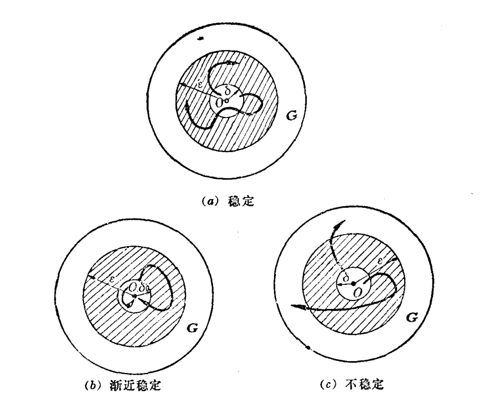

# 动力系统的稳定性

==定义== 如果对任意给定的 $\varepsilon>0$, 存在 $\delta>0\left(\delta\right.$ 一般与 $\varepsilon$ 和 $t_0$有关), 使当任一 $x_0$ 满足
$$
\left\|x_0\right\| \leqslant \delta
$$

时, 方程组 (6.8) 的由初始条件 $\boldsymbol{x}\left(t_0\right)=\boldsymbol{x}_0$ 确定的解 $\boldsymbol{x}(t)$ 均有
$$
\|x(t)\|<\varepsilon \quad , \forall t \geqslant t_0,
$$

则称方程组 (6.8) 的零解 $\boldsymbol{x}=\boldsymbol{0}$ 为稳定的.

==如果零解 $\boldsymbol{x}=0$ 稳定,== 且存在这样的 $\delta_0>0$ 使当
$$
\left\|x_0\right\|<\delta_0
$$

时, 满足初始条仵 $x\left(t_0\right)=x_0$ 的解 $x(t)$ 均有
$$
\lim _{t \rightarrow+\infty} x(t)=0
$$

则称零解 $\boldsymbol{x}=\boldsymbol{0}$ 为渐近稳定的.

如果 $x=0$ 渐近稳定, 且存在域 $D_0$, 当且仅当 $x_0 \in D_0$ 时满足初始条件 $x\left(t_0\right)=x_0$ 的解 $x(t)$ 约有 $\lim _{t \rightarrow+\infty} x(t)=0$, 则域 $D_0$ 称为 (==渐近) 稳定域或吸引域==. 若稳定域为全空间, 即 $\delta_0=+\infty$, 则称零解 $\boldsymbol{x}=\mathbf{0}$ 为==全局渐近稳定的或简称全局稳定的==.

当零解 $\boldsymbol{x}=\mathbf{0}$ 不是稳定时, 称它是不稳定的. 即是说: 如果对某个给定的 $\varepsilon>0$ 不管 $\delta>0$ 怎样小, 总有一个 $x_0$ 满足 $\left\|x_0\right\| \leqslant \delta$, 使由初始条件 $x\left(t_0\right)=x_0$ 所确定的解 $x(t)$, 至少存在某个 $t_1>t_0$ 。使得
$$
\left\|x\left(t_1\right)\right\|=\varepsilon
$$

则称方程组 (6.8) 的零解 $x=0$ 为不稳定的.

在二维情形零解的稳定形态，在平面上的示意图如下图

## 相平面

现在讨论二阶微分方程组
$$
\begin{equation}\label{ode}
    \left\{\begin{array}{l}
    \frac{d x}{d t}=X(t ; x, y) \\
    \frac{d y}{d t}=Y(t ; x, y)
    \end{array}\right.
\end{equation}
$$

它的解
$$
x=x(t), \quad y=y(t)
$$

在以 $t, x, y$ 为坐标的 (欧氏)空间中决定了一条曲线, 这曲线称为==积分曲线==。假设方程右端的函数满足解的存在唯一性和连续性定理的条件, 例如存在连续偏导数, 此时空间的每一点都有一条且只有一条积分曲线经过

 
