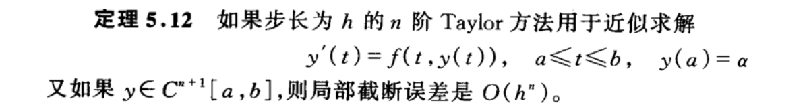
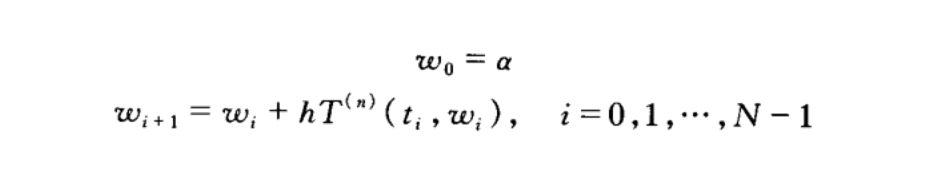
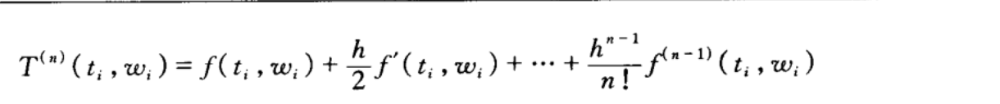
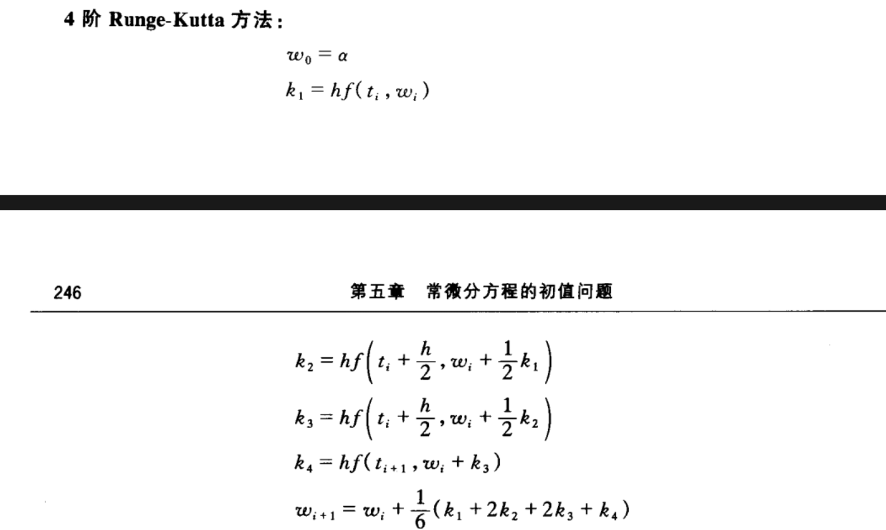

# 常微分方程数值解

## 预备知识

> ==术语截断误差==指的是使用被截的即有限的和来近似计算无穷级数的和所产生的误差。

> ==舍入误差==是计算器或计算机进行实数计算时所产生的。之所以产生舍人误差是因为机器中进行的算术运算所涉及的数是有限位的，从而导致计算只能用实际数值的近似表示式来完成。在典型的计算机中，仅实数系统的一个相对小的子集用于表示所有的实数。这个子集仅包含了正/负有理数，且存储了小数部分和指数部分。

定义 1.17 假设 $E_0>0$ 表示初始误差, $E_n$ 表示在以后的 $n$ 步运算之后误差的大小。如果 $E_n \approx C n E_0$ (这里 $C$ 是一个不依赖于 $n$ 的常数), 则误差的增长称为是线性的。如果 $E_n \approx C^n E_0$ (对某个 $C>1$ ), 则误差的增长称为是指数的。

定义 1.18 设 $\left\{\beta_n\right\}_{n=1}^{\infty}$ 是一个收玫于 0 的已知序列, $\left\{\alpha_n\right\}_{n=1}^{\infty}$ 收敛于数 $\alpha$ 。如果存在一个正常数 $K$ 使得
$$
\left|\alpha_n-\alpha\right| \leqslant K\left|\beta_n\right|
$$

对大的 $n$ 成立, 则称 $\left\{\alpha_n\right\}_{n=1}^{\infty}$ 以收玫速度 $O\left(\beta_n\right)$ (此表达式读作 “ $\beta_n$ 的大 oh”) 收玫于 $\alpha_0$ 。记为 $\alpha_n=\alpha+O\left(\beta_n\right)_{\circ}$

虽然定义 1.18 允许将 $\left\{\alpha_n\right\}_{n=1}^{\infty}$ 与任意序列 $\left\{\beta_n\right\}_{n=1}^{\infty}$ 进行比较, 但是几乎在每一种情况下都使用
$$

\beta_n=\frac{1}{n^p}
$$
其中 $p$ 为大于零的某个数。人们通常对于使 $\alpha_n=\alpha+O\left(1 / n^p\right)$ 成立的最大的 $p$ 值感兴趣。

初值问题
$$
\begin{equation}
\label{ode}
\frac{\mathrm{d} y}{\mathrm{~d} t}=f(t, y), \quad a \leqslant t \leqslant b, \quad y(a)=\alpha
\end{equation}
$$

称为是一个==适定的问题==,如果:
1. 问题存在一个唯一的解 $y(t)$;
2. 对任何 $\varepsilon>0$, 存在一个正常数 $k(\varepsilon)$, 使得只要当 $\left|\varepsilon_0\right|<\varepsilon, \delta(t)$ 是连续的且在 $[a, b]$ 上 $|\delta(t)|<\varepsilon$ 时, 就有问题
$$
\begin{equation}
\label{sode}
\frac{\mathrm{d} z}{\mathrm{~d} t}=f(t, z)+\delta(t), \quad a \leqslant t \leqslant b, \quad z(a)=\alpha+\varepsilon_0
\end{equation}
$$

存在唯一解 $z(t)$, 且
$$
|z(t)-y(t)|<k(\varepsilon) \varepsilon
$$

对一切 $a \leqslant t \leqslant b$ 成立。
由式 $\ref{sode}$ 所定义的问题称作和原问题 $\ref{ode}$ 相伴的摄动问题。它假定微分方程有可能有误差 $\delta(t)$ 以及初值条件也有可能存在误差 $\varepsilon_0$ 。

因为表示式中的任何舍人误差都使原问题摄动,所以数值方法总与求解摄动问题有关。如果原问题不是适定的，则没有理由期望摄动问题的数值解会精确地近原问题的解。

定理 5.6 假设 $D=\{(t, y) \mid a \leqslant t \leqslant b,-\infty<y<\infty\}$ 。如果 $f$ 是连续的, 且在 $D$ 上关于变量 $y$ 满足 $Lipschitz$ 条件, 则初值问题
$$
\frac{\mathrm{d} y}{\mathrm{~d} t}=f(t, y), \quad a \leqslant t \leqslant b, \quad y(a)=\alpha
$$

是适定的。

## Euler法

虽然Euler法的精确性不足以保证它在实际中的使用，但是在分析从它的应用所产生的误差方面它是一个重要的基础。在下面各节所考虑的更精确方法的误差分析按照同样的模式，只不过更复杂一些。

为推导 Euler 法的误差界, 需要两个计算引理。

**==引理 5.7== 对所有 $x \geqslant-1$ 和任何正整数 $m$, 有 $0 \leqslant(1+x)^m \leqslant \mathrm{e}^{m x}$ 。**

证明 对 $f(x)=\mathrm{e}^x, x_0=0$ 和 $n=1$, 应用 Taylor 定理得
$$
\mathrm{e}^x=1+x+\frac{1}{2} x^2 \mathrm{e}^{\xi}
$$

其中, $\xi$ 位于 $x$ 和 0 之间。从而,有
$$
0 \leqslant 1+x \leqslant 1+x+\frac{1}{2} x^2 \mathrm{e}^{\varepsilon}=\mathrm{e}^x
$$

又因为 $1+x \geqslant 0$, 所以
$$
0 \leqslant(1+x)^m \leqslant\left(\mathrm{e}^x\right)^m=\mathrm{e}^{m x}
$$
==定理 5.9== 假设 $f$ 是连续的, 且在
$$
D=\{(t, y) \mid a \leqslant t \leqslant b,-\infty<y<\infty\}
$$

上满足常数为 $L$ 的 $Lipschitz$ 条件, 又假设存在常数 $M$ 使得
$$
\left|y^{\prime \prime}(t)\right| \leqslant M
$$

对一切 $t \in[a, b]$ 成立。设 $y(t)$ 表示初值问题
$$
y^{\prime}=f(t, y), \quad a \leqslant t \leqslant b, \quad y(a)=\alpha
$$

的唯一解, $w_0, w_1, \cdots, w_N$ 是由 Euler 法对某个正整数 $N$ 产生的近似。则对于 $i=0,1,2, \cdots, N$,有
$$
\left|y\left(t_i\right)-w_i\right| \leqslant \frac{h M}{2 L}\left[\mathrm{e}^{L\left(t_i-a\right)}-1\right]
$$

## Talyot法

定义 5.11 差分法
$$
\begin{gathered}
w_0=\alpha \\
w_{i+1}=w_i+h \phi\left(t_i, w_i\right), \quad i=0,1, \cdots, N-1
\end{gathered}
$$

有局部截断误差
$$
\tau_{i+1}(h)=\frac{y_{i+1}-\left(y_i+h \phi\left(t_i, y_i\right)\right)}{h}=\frac{y_{i+1}-y_i}{h}-\phi\left(t_i, y_i\right)
$$

对 $i=0,1, \cdots, N-1$ 成立。
对于 Euler 法,在第 $i$ 步对问题
$$
y^{\prime}=f(t, y), \quad a \leqslant t \leqslant b, \quad y(a)=\alpha
$$

的局部截断误差是
$$
\tau_{i+1}(h)=\frac{y_{i+1}-y_i}{h}-f\left(t_i, y_i\right), \quad i=0,1, \cdots, N-1
$$

## runge-kutta法

​                                                                                                                                                                                                                                                                                                                                                                                                                                                                                                                                                                                                                                                                                                                                                                                                                                                                                                                                                                                                    