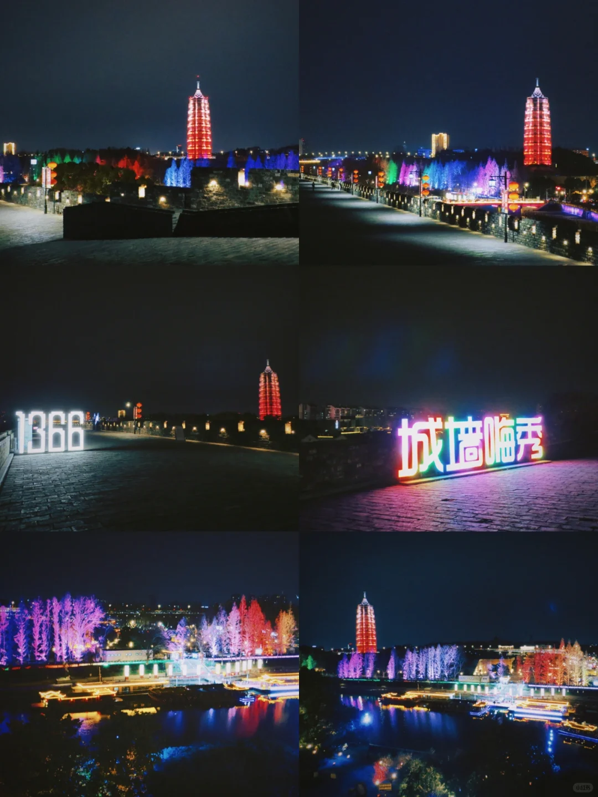

# 旅游之南京篇

## 第一天

### 南京博物馆

中国三大博物馆之一，虽然挂南京的名，但相当于其他的省博物馆。一院六馆各有特色。无论看展览、拍照还是集章，都是来南京的首选。

::: important

镇馆之宝有：错银铜牛灯、鎏金镶嵌兽形铜盒砚、广陵王玺金印等等

:::

> 已预约 12:00-16:00 下午场

### 玄武湖

南京最知名的一个湖，南京站南广场正对面，湖边看看花，走一走，感受南京人的后花园～
⏰2小时起

地铁1号线玄武湖

> 已经预约 12:00 -19:00 场次

::: important

可以搭配鸡鸣寺、南京城墙、情侣园等一同游玩

:::

### 明城墙+夫子庙秦淮河夜游

中华门城堡➠老门东➠乌衣巷➠秦淮河➠夫子庙➠江南贡院

【中华门城堡】又称聚宝门，是国内保存zui完好的城墙堡垒，瓮城高大雄伟，在日落时分登城，看一看夕阳下的南京城真的绝了，在过年期间也会有也灯会夜游！
⏰ 开放时间：8:30-20:30
🎫 门票50💰；游园卡可用；

【老门东】三条营的龙灯已经亮了，城墙边的巨型龙灯也已经就位，今年的灯会声势浩大，不如趁人少先睹为快吧；南京小吃鸭血粉丝汤、小馄饨一定别错过，记得放辣油哦。
⏰ 亮灯时间：17:30

> 参考[📍南京｜老门东最强攻略 (xiaohongshu.com)](https://www.xiaohongshu.com/explore/6540c2f4000000002500b2b0?m_source=bingsem)

【夫子庙秦淮河】金陵入夜看秦淮，坐画舫夜游，从夫子庙前天下文枢牌坊下的洋池登船，沿途经过桃叶渡、白鹭洲公园、水街、东水关、回到浮池码头。
⏰ 开放时间：日场：09:00-18:00；夜18:00-22:00
夜场需要在下午16:00前预约
🎫 船票：白天60💰、晚上80💰

> 参考：[南京|夜游秦淮河攻略（含绝美机位） (xiaohongshu.com)](https://www.xiaohongshu.com/explore/63f18f6c0000000013036366?m_source=bingsem)

::: important

游船上岸线路：夫子庙大成殿、江南贡院、乌衣巷、文德桥，感受下夫子庙接踵摩肩的热闹.

:::
